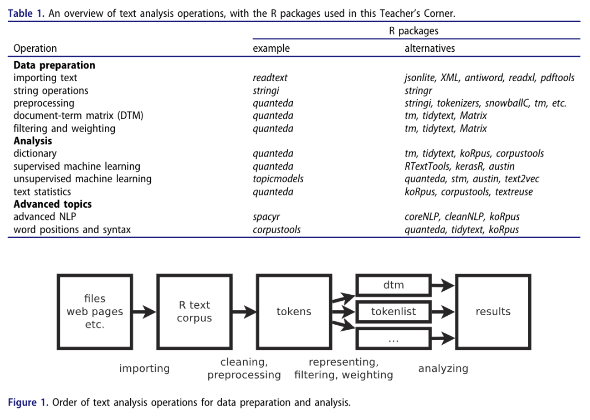
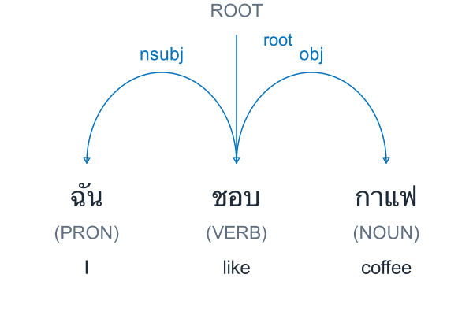

```{r}
#| label: setup
#| include: false
library(quanteda)
library(stringr)
library(knitr)
raw <- read.csv("../lab/toy/teaching_corpus.csv",
                fileEncoding = "UTF-8", stringsAsFactors = FALSE)
corp <- corpus(raw, docid_field = "doc_id", text_field = "text")
toks <- tokens(corp, remove_punct = TRUE) |> tokens_tolower()
sw <- setdiff(stopwords("en"), c("not", "no", "nor"))
toks_content <- tokens_remove(toks, pattern = sw)
x <- dfm(toks_content)
x_weighted <- dfm_tfidf(x, scheme_tf = "count", scheme_df = "inverse", base = 10)
```
## Learning objectives

:::::: {.slide-body}

**Week 2: Text Preparation in R and Python: Collaborative Workflow**

- Set up RStudio and Positron for text analysis with R and Python.
- Organize code with GitHub and submit written coursework through shared Overleaf projects.
- Inspect supplied corpora and check project data feasibility: coverage, metadata, and access.
- Clean and tokenize text, build a DFM, and evaluate preprocessing choices.

::: {.key}
**Week 4 content introduced today:** Text preprocessing and document-feature matrices (DFMs). Week 4 builds on these with dictionaries, sentiment analysis, and validation.
:::

::::::

::: {.source}
Schoonvelde (2026); Welbers et al. (2017)
:::

::: {.notes}
**Purpose.** Frame preparation as a series of research decisions whose consequences students must explain.

**Week 2 and Week 4.** Locate this session in the syllabus: Week 2 introduces the R/Python environment and the course's collaborative workflow. Orient students to GitHub for code and shared Overleaf projects for written coursework. The hands-on setup covers R, Python, RStudio, and Positron. Use the supplied corpora to introduce a basic feasibility check: Do the texts cover the research population? Are the required metadata available? Can students access and use the data? Today's text preprocessing, tokenization, and DFM examples bring forward part of Week 4. Week 4 will build on this preparation to develop dictionary-based measurement, sentiment analysis, and validation. Multilingual segmentation and POS tags remain instructor demonstrations. Emphasize that preparation choices change the evidence available for a research question.

**Explain.** Follow the route from corpus selection to strings, tokens, features, and validation. The take-home assignment is the Week 2 lab, using R to inspect and prepare House of Commons speeches. Multilingual annotations are prepared instructor demonstrations; the R–Python examples show how this workflow can later expand.

**Ask.** Which decision comes before choosing a tokenizer? Invite answers about the research question, eligible documents, and unit of analysis.

**Transition.** Introduce the five principles that will guide those decisions throughout the lecture.

**Session route and pacing.** Suggested 145-minute session, including 20 minutes for classroom setup and 5 minutes to introduce the take-home lab; adapt to download speeds and the class length. Students work through the lab independently after class. Questions can be discussed before class if time permits or during TA hours.

- Slides 1–7: research question, population, corpus and document unit (15 minutes).
- Slides 8–15: toolkit orientation, R/Python handoff and the object map (15 minutes).
- Slides 16–23: importing, cleaning and an inspectable corpus (20 minutes).
- Slides 24–35: token choices, feature choices and information loss (25 minutes).
- Slides 36–44: instructor demonstration of multilingual annotation and measurement (20 minutes).
- Slides 45–53: feature-definition diagram, DFM diagnostics, weighting, context, Wordfish overview and sensitivity (20 minutes).
- Slide 54: install R, Python, RStudio, and Positron; try the consoles and open the lab (20 minutes).
- Slides 55–56: introduce the Week 2 lab, independent practice, and support arrangements (5 minutes).
- Slides 57–58: closing questions and readings (5 minutes).

**Keep the examples connected.** Coffee posts introduce population coverage and later return as a candidate preference measure. Parliamentary material illustrates document units and cleaning judgments. Four synthetic English documents make the lecture's count, TF-IDF and KWIC examples inspectable by hand. The take-home lab uses a separate sample of 5,000 House of Commons speech contributions. State when switching between these examples.

**Maintain the main argument.** Research question → eligible documents → preserved raw text → chosen tokens and features → representation → interpretation and validation. The toolkit overview explains available routes. The early DFM table is a preview; the later DFM section returns to implementation. After the multilingual demonstration, use the two-sentence diagram to distinguish word counts, POS selection, and dictionary categories, then return explicitly to the four English lecture documents.

**Teaching boundaries.** Students install both language runtimes and both editors, then try a simple command in each language. The take-home lab uses R with dplyr, stringr, ggplot2, quanteda, quanteda.textstats, and quanteda.textplots; students may use either RStudio or Positron. Python integration and UDPipe are conceptual or instructor-led examples. Students do not install Python NLP tools, download models, call the Thai API, or compile the lecture.

**If time is short.** Summarize package and IDE details, and use the supplied multilingual outputs without a live model run. Preserve the corpus-selection argument, the negation example, one TF-IDF calculation, the KWIC interpretation, and clear directions for the take-home lab.

**Background and sources.**

The four-document corpus is synthetic, so students can check every result by hand.

Sources: Schoonvelde (2026), Slides_QTA_2, pp. 2–4, 20; Welbers, Van Atteveldt & Benoit (2017), Text Analysis in R, pp. 246–247.
:::

## Five principles of quantitative text analysis

:::::: {.slide-body}

1. **Domain knowledge** defines the research problem and relevant evidence.
2. **Human judgment** guides interpretation and validation.
3. **Discovery and testing** require distinct stages.
4. **The task** determines which methods are useful.
5. **Validation** evaluates whether the measure fits the claim.

::::::

::: {.source}
Schoonvelde (2026); Grimmer et al. (2022)
:::

::: {.notes}
**Purpose.** Establish the criteria for judging every later software choice.

**Explain.** Start with a substantive concept, such as expressed preference for coffee. Finding the word coffee does not yet establish preference. Human interpretation defines the coding problem, and validation checks whether a proposed measure captures it. Present these principles as the supplied lecture's summary of Grimmer and colleagues.

**Ask.** What evidence would convince you that a coffee preference measure works? Seek examples of checking texts against human judgments.

**Transition.** Before measuring the texts, specify which documents the claim concerns.

**Background and sources.**

Ask students to name a substantive concept before naming software. A plausible interpretation of a discovered pattern still needs an appropriate test. These are the five principles as summarized in the supplied Essex slides, rather than a direct quotation from the textbook.

Sources: Schoonvelde (2026), Slides_QTA_2, p. 3, summarizing Grimmer, Roberts & Stewart (2022).
:::

## Selecting documents: Chapter 4<br>(Grimmer et al. 2022)

:::::: {.slide-body}

**Classroom example:** measuring expressed preference for coffee.

| Design choice | Example |
|---|---|
| Target population | Thai-language public posts about coffee in a specified month |
| Quantity of interest | Share of those posts expressing positive preference for coffee |
| Observed corpus | Posts returned by one platform API and a specified keyword search |

**Found data:** document how the texts were produced, preserved and retrieved.

The next step is to examine what the collection process leaves out.

::::::

::: {.source}
Grimmer et al. (2022)
:::

::: {.notes}
**Purpose.** Connect the Chapter 4 reading to a concrete population and quantity of interest.

**Explain.** Contrast all eligible Thai-language coffee posts in the month with posts actually retrieved. The proposed quantity concerns posts, not all consumers. Introduce coffee as the example we will revisit when dependency relations become a candidate preference measure.

**Ask.** Could flawless sentiment coding compensate for missing platforms or posts without the search term? No: coding accuracy and corpus coverage are separate questions.

**Transition.** Identify four ways the observed collection can differ from the intended population.

**Background and sources.**

Allow about three minutes. Chapter 4 covers populations and quantities of interest, four types of bias, and considerations of found data. Use these themes to connect research design to corpus construction before discussing preprocessing.

The coffee example is an original classroom illustration. First define the eligible posts, time window and language. The quantity of interest is a proportion of posts. A claim about all consumers would require a different sampling argument. Ask how one platform's users, API coverage and keyword choices affect which posts enter the corpus. Keep the intended population distinct from the corpus actually retrieved.

The Thai dependency example later demonstrates a candidate coding rule for expressed preference. Even a perfectly coded sentence cannot establish that the corpus covers the intended population. The following slide distinguishes resource, incentive, medium and retrieval bias.

Reading: Grimmer, Justin, Margaret E. Roberts, and Brandon M. Stewart (2022). Text as Data: A New Framework for Machine Learning and the Social Sciences. Princeton University Press. Chapter 4, Selecting Documents, pp. 41–47. Publisher book page: https://press.princeton.edu/books/hardcover/9780691207544/text-as-data. Chapter outline: https://ingramacademic.com/products/text-as-data-9780691207551.
:::

## Selection bias begins before preprocessing

:::::: {.slide-body}

| Source of bias | Example | Research consequence |
|---|---|---|
| Resources | Well-funded groups archive more documents | Available texts overrepresent some actors |
| Incentives | Politicians publish strategically | Public statements differ from private beliefs |
| Medium | A platform limits length or visibility | The medium shapes expression |
| Retrieval | Searching only for “economy” | Relevant texts with other words disappear |

::::::

::: {.source}
Schoonvelde (2026); Grimmer et al. (2022)
:::

::: {.notes}
**Purpose.** Show why data acquisition is part of research design.

**Explain.** Walk through resources, incentives, medium, and retrieval using the table. Emphasize the mechanism in each row: who can preserve text, why people publish, how the channel shapes expression, and how search rules admit documents.

**Ask.** If we download more results from the same narrow keyword query, which omissions remain? Relevant texts using different vocabulary can still be absent.

**Transition.** Turn these concerns into explicit corpus boundaries, document units, and identifiers that can be recorded.

**Background and sources.**

A perfectly reproducible import cannot recover documents excluded by a narrow sampling rule. Ask which groups, topics, or periods might be missing.

Sources: Schoonvelde (2026), Slides_QTA_2, p. 4. The four category names also organize §4.2 of Grimmer, Roberts & Stewart (2022), Text as Data, Chapter 4. Examples in this table are teaching illustrations.
:::

## Corpus boundaries and document units

:::::: {.slide-body}

| Decision | Example | What to record |
|---|---|---|
| Population | Parliamentary speech contributions | Chamber, actors, dates |
| Inclusion | All contributions in selected debates | Rule and exclusions |
| Document unit | One contribution per row | How segments were defined |
| Identifier | A persistent `doc_id` | Links to source and metadata |

Changing the unit to speaker-day or party-year changes the comparison.

::::::

::: {.source}
Schoonvelde (2026); Welbers et al. (2017)
:::

::: {.notes}
**Purpose.** Make the unit of analysis an explicit design choice.

**Explain.** Switch from coffee posts to parliamentary contributions as a second illustration of the same selection principles. One PDF may contain many contributions; a file is therefore not automatically one document. Explain why each chosen unit needs a persistent identifier and metadata.

**Ask.** Would grouping speeches by party-year preserve the same comparisons? No: the unit, counts, and document frequencies would change.

**Transition.** With the intended documents defined, choose an import route that preserves their boundaries and identifiers.

**Background and sources.**

Document units need not equal source files. A PDF may contain many speeches, while several files may describe one document. Grouping also changes document frequency and therefore weighting.

Sources: Schoonvelde (2026), Slides_QTA_2, pp. 4, 20; Welbers, Van Atteveldt & Benoit (2017), Text Analysis in R, pp. 248, 253.
:::

## Sources and import routes

:::::: {.slide-body}

| Source | Typical route | First check |
|---|---|---|
| Existing corpus | Download plus codebook | Coverage and sampling |
| TXT, CSV, TSV | `readr`, `data.table`, base R | Encoding and columns |
| JSON or API | `jsonlite`, `httr2` | Pagination and identifiers |
| HTML or XML | `rvest`, `xml2` | Boilerplate and structure |
| PDF or DOCX | `pdftools`, `readtext` | Reading order and document boundaries |

Scanned PDFs may need OCR before they contain usable text.

::::::

::: {.source}
Schoonvelde (2026); Welbers et al. (2017)
:::

::: {.notes}
**Purpose.** Connect source formats to practical checks rather than a package-shopping list.

**Explain.** Select two contrasting rows, such as CSV and PDF. A CSV needs column and encoding checks; a PDF also needs inspection of reading order and document boundaries. An API provides access but does not define the research population.

**Ask.** If extracted PDF text is readable, what might still be wrong? Paragraph order or the boundaries between contributions may have changed.

**Transition.** Use the historical toolkit table to locate importing within the wider analysis workflow.

**Background and sources.**

Package names follow the supplied 2026 slides. An API is an access route, not a research design. Inspect the raw file before trusting parsed output. Importing a PDF does not guarantee correct sentence order.

Sources: Schoonvelde (2026), Slides_QTA_2, pp. 5–9; Welbers, Van Atteveldt & Benoit (2017), Text Analysis in R, pp. 248–249.
:::

## The R text-analysis toolkit in 2017

:::::: {.slide-body}

```{=html}
<div class="source-crop table-crop"></div>
```

::: {.small}
Historical package overview (2017). Package responsibilities and APIs have since changed.
:::

::::::

::: {.source}
Welbers et al. (2017)
:::

::: {.notes}
**Purpose.** Give a historical map of operations without requiring students to memorize package names.

**Explain.** Read the preparation, analysis, and advanced-topic groups. Emphasize the recurring tasks: import, clean, represent, and analyze. This table describes 2017; later tool responsibilities and interfaces can differ. Keep the next toolkit slides as orientation for the workflow.

**Ask.** Which rows prepare evidence, and which rows apply an analysis method? Let students locate one example of each.

**Transition.** Add two kinds of output that help explain later tools: linguistic annotations and embeddings.

**Background and sources.**

The user-provided screenshot reproduces Table 1 and Figure 1 from printed page 247. This slide displays the table region at slide width. Ask students to distinguish the preparation stages from the analysis methods. Treat the table as a 2017 inventory, not an installation list for today.

Sources: Welbers, Van Atteveldt & Benoit (2017), Text Analysis in R, p. 247, Table 1. User-provided screenshot.
:::

## Beyond 2017: annotation and embeddings

:::::: {.slide-body}

::: {.small}
| Tool / access from R | Model type | Output and use |
|---|---|---|
| **UDPipe 1**: R `udpipe` | Supervised annotation pipeline trained on a treebank | Tokens, lemmas, POS, dependency labels |
| **UDPipe 2**: R + REST API | Neural annotation with contextual embeddings | Linguistic annotations; current models use BERT-based representations |
| **Flair**: R `reticulate` + Python<br>(`flaiR`; Liao et al., 2023) | Contextual string embeddings or Transformer embeddings | Word/document vectors; models for NER, tagging and classification |
:::

**FlairEmbeddings** uses character language models; **TransformerWordEmbeddings** uses models such as BERT.

R can prepare text, call these tools, and analyze the returned annotations or vectors.

::::::

::: {.source}
Straka & Straková (2017); Straka (2018); Akbik et al. (2018, 2019); Liao et al. (2023)
:::

::: {.notes}
**Purpose.** Separate interpretable linguistic annotations from numerical representations.

**Explain.** UDPipe returns fields such as POS and dependency labels; embedding classes return vectors that task models can use. Flair's original contextual string embeddings and its Transformer embeddings are different families. Keep engine and model-release details as backup; UDPipe 1 also contains neural components.

**Ask.** Does obtaining an embedding automatically provide a validated preference label? No: representation and measurement remain separate steps.

**Transition.** Compare the toolkits by their practical roles. These extensions remain conceptual or instructor-led, with no student installation task.

**Background and sources.**

This is a later supplement to the historical 2017 table. Flair's contextual string embeddings paper appeared in 2018 and the framework paper in 2019. Flair is the Python framework; flaiR is an R interface that uses reticulate to access it. R users can use flaiR wrapper functions or call Python directly through reticulate. A Python environment and the relevant models are still required. The classroom annotation examples remain R scripts.

flaiR sources: [Package documentation](https://davidycliao.github.io/flaiR/), [Quick Start](https://davidycliao.github.io/flaiR/articles/quickstart.html), and [official changelog](https://davidycliao.github.io/flaiR/news/index.html). Liao et al. (2023) refers to the historical R package; the changelog records version 0.0.3 on September 10, 2023, followed by 0.0.5 and 0.0.6 in October 2023. The [current package citation](https://davidycliao.github.io/flaiR/authors.html) gives 2025 specifically for version 0.1.8. Accessed September 17, 2026.

An embedding is a numerical vector representation. FlairEmbeddings builds contextual representations from character-level language models. Flair also exposes TransformerWordEmbeddings and TransformerDocumentEmbeddings, including BERT and RoBERTa representations. These embedding classes produce vectors; task models use them for tasks such as named-entity recognition (NER), tagging, or classification. Do not identify the original Flair embedding architecture with Transformers or with a generative chatbot.

The local R udpipe package embeds UDPipe 1.2.1. Its language-specific models learn annotation tasks from UD treebanks; the UDPipe 1 pipeline includes neural components, so the contrast is not neural versus non-neural. The filename chinese-gsd-ud-2.5-191206.udpipe records the UD 2.5 treebank release and model release date. It does not indicate the UDPipe 2 engine. Model selection also involves language, treebank/domain, and version: Chinese-GSD uses Traditional Chinese, English-EWT English, and Japanese-GSD Japanese.

UDPipe 2 is a neural tagging/parsing system. Current UD 2.17 model bundles use multilingual BERT or RobeCzech contextual word embeddings. The core UDPipe 2 prototype does not itself tokenize; the official service bundles provide a tokenizer and can return a complete annotation pipeline. The Thai instructor demonstration calls the pinned thai-tud-ud-2.17-251125 service model from R and reuses its cached response. These are task-specific annotation systems, not general-purpose text-generation models. The 2018 paper describes the method; current model composition is documented on the models page.

Sources: [Flair contextual string embeddings](https://flairnlp.github.io/docs/tutorial-embeddings/flair-embeddings), [Flair Transformer embeddings](https://flairnlp.github.io/docs/tutorial-embeddings/transformer-embeddings), [R udpipe NEWS](https://github.com/bnosac/udpipe/blob/master/NEWS.md), [UDPipe 1 manual](https://ufal.mff.cuni.cz/udpipe/1/users-manual), [UDPipe 2 models](https://ufal.mff.cuni.cz/udpipe/2/models), [UDPipe 2 overview](https://ufal.mff.cuni.cz/udpipe/2), [reticulate](https://rstudio.github.io/reticulate/). Accessed September 17, 2026.

Akbik, A., Blythe, D., & Vollgraf, R. (2018). Contextual String Embeddings for Sequence Labeling. Proceedings of COLING 2018, 1638–1649. https://aclanthology.org/C18-1139/.

Akbik, A., Bergmann, T., Blythe, D., Rasul, K., Schweter, S., & Vollgraf, R. (2019). FLAIR: An Easy-to-Use Framework for State-of-the-Art NLP. Proceedings of NAACL-HLT 2019: Demonstrations, 54–59. https://aclanthology.org/N19-4010/.

Straka, M., & Straková, J. (2017). Tokenizing, POS Tagging, Lemmatizing and Parsing UD 2.0 with UDPipe. Proceedings of the CoNLL 2017 Shared Task, 88–99. https://doi.org/10.18653/v1/K17-3009.

Straka, M. (2018). UDPipe 2.0 Prototype at CoNLL 2018 UD Shared Task. Proceedings of the CoNLL 2018 Shared Task, 197–207. https://doi.org/10.18653/v1/K18-2020.
:::

## quanteda, UDPipe, spaCy, and Flair

:::::: {.slide-body}

| Tool / access | Main emphasis | Typical output |
|---|---|---|
| **quanteda** (R) | Corpus management and feature analysis | Corpus, tokens, DFM; KWIC and TF-IDF |
| **UDPipe** (R / API) | Linguistic annotation using trained models | Tokens, lemmas, POS, UD dependency labels |
| **spaCy** (Python) | Configurable NLP pipelines | Tokens, POS, dependencies, named entities |
| **Flair** (Python)<br>**flaiR**: R wrapper for Python Flair | Embeddings and neural task models | Vectors; entity labels, POS, text categories |

**The tools can work together:** lemmas or selected annotations can become features in a quanteda DFM.

Capabilities overlap and depend on the language, model, and task.

::::::

::: {.source}
Benoit et al. (2018); Straka & Straková (2017); Explosion (n.d.); Akbik et al. (2019); Liao et al. (2023)
:::

::: {.notes}
**Purpose.** Help students choose a tool by the output their question needs.

**Explain.** Use quanteda for the course's corpus, token, DFM, and context workflow. Use the annotation tools to illustrate grammatical or entity information, and Flair to illustrate embeddings and task models. Point out flaiR as the R interface to the Python Flair framework. Capabilities overlap; language and model choices matter.

**Ask.** Which output helps distinguish who likes what: a frequency count or a dependency relation? The relation supplies relevant structure, but still needs checking.

**Transition.** Show how R and Python can exchange these outputs within one research project.

**Background and sources.**

This comparison concerns the main role of each toolkit in a research workflow. It is not a ranking or a list of mutually exclusive capabilities. The preceding slide distinguishes model families; this slide compares toolkit roles before the following R/Python workflow example.

quanteda organizes texts with document metadata, tokenizes and transforms them, constructs document-feature matrices, inspects keywords in context, and weights features. Its core functions do not themselves supply a pretrained POS tagger or dependency parser. The wider quanteda family provides additional statistical, modeling, and plotting packages. The Week 2 lab uses quanteda and stringr alongside dplyr, ggplot2, quanteda.textstats, and quanteda.textplots.

UDPipe uses language-specific trained models for tokenization, lemmatization, POS tagging, and dependency parsing under Universal Dependencies. Individual models can omit some outputs: the supplied Thai model has no lemmas. In this course, R calls local UDPipe 1 models or the UDPipe 2 REST API. These are instructor demonstrations.

spaCy is a Python library with configurable pipelines and rules. A trained pipeline may include a tagger, lemmatizer, parser, and named-entity recognizer; available components depend on the language and model. NER identifies named entities such as people, organizations, and places. spaCy's dependency label set is model-specific and is not necessarily UD. For example, the official English documentation shows dobj, prep, and ROOT, while the UDPipe examples here use UD obj and root. Do not equate labels across tools without checking the model documentation.

Flair is a Python framework for embeddings and neural NLP tasks. flaiR provides R wrapper functions through reticulate; it uses the Python framework and its models rather than a separate model family. The outputs in this row describe the underlying Flair toolkit; available wrappers and outputs depend on the selected task and model. Embedding classes produce vectors; task models predict labels such as entities, POS, or document categories. The original contextual string embeddings and Transformer embeddings are different representation families. For this introductory comparison, dependency parsing is illustrated with UDPipe and spaCy, while Flair illustrates representations and task models; these are emphases rather than claims of exclusive capabilities.

flaiR sources: [Package documentation](https://davidycliao.github.io/flaiR/), [Quick Start](https://davidycliao.github.io/flaiR/articles/quickstart.html), and [official changelog](https://davidycliao.github.io/flaiR/news/index.html). Liao et al. (2023) refers to the historical R package; the changelog records version 0.0.3 on September 10, 2023, followed by 0.0.5 and 0.0.6 in October 2023. The [current package citation](https://davidycliao.github.io/flaiR/authors.html) gives 2025 specifically for version 0.1.8. Accessed September 17, 2026.

R can call Python tools through reticulate; flaiR and spacyr provide R interfaces to Flair and spaCy, respectively. External annotations can be imported while preserving document IDs, sentence IDs, token order, and the original text. For example, choose lemma features or a validated POS subset, then construct a quanteda DFM from those existing tokens. A DFM stores feature values, so retain the annotation table if dependency links are needed later.

Teaching prompts: For word frequency or context inspection, use quanteda. For grammatical relations such as who is linked to a predicate and object, inspect a parser's annotations. For named entities, consider an appropriate spaCy or Flair model. Evaluate model errors on the corpus before turning any output into a research measure. These examples explain tool choice; they add no installation or execution requirement to the student lab.

Sources: [quanteda overview](https://quanteda.io/), [importing tokens](https://quanteda.io/reference/tokens.html), [UDPipe 1](https://ufal.mff.cuni.cz/udpipe/1), [spaCy 101](https://spacy.io/usage/spacy-101), [Flair quick start](https://flairnlp.github.io/docs/intro), [Flair embeddings](https://flairnlp.github.io/docs/tutorial-embeddings/flair-embeddings), [reticulate](https://rstudio.github.io/reticulate/). Accessed September 17, 2026.

Benoit, K., Watanabe, K., Wang, H., Nulty, P., Obeng, A., Müller, S., & Matsuo, A. (2018). quanteda: An R package for the quantitative analysis of textual data. Journal of Open Source Software, 3(30), 774. https://doi.org/10.21105/joss.00774.

Straka, M., & Straková, J. (2017). Tokenizing, POS Tagging, Lemmatizing and Parsing UD 2.0 with UDPipe. Proceedings of the CoNLL 2017 Shared Task, 88–99. https://doi.org/10.18653/v1/K17-3009.

Explosion. (n.d.). spaCy 101: Everything you need to know. https://spacy.io/usage/spacy-101. Accessed September 17, 2026.

Akbik, A., Bergmann, T., Blythe, D., Rasul, K., Schweter, S., & Vollgraf, R. (2019). FLAIR: An Easy-to-Use Framework for State-of-the-Art NLP. Proceedings of NAACL-HLT 2019: Demonstrations, 54–59. https://aclanthology.org/N19-4010/.
:::

## Beyond 2017: R and Python in one workflow

:::::: {.slide-body}

**One possible application:** compare the meanings of policy statements.

| Stage | Example tools | Contribution |
|---|---|---|
| Prepare in R | `stringr`, `quanteda` | Clean text and preserve document IDs |
| Represent in Python | `sentence-transformers` | Encode texts as semantic vectors |
| Evaluate in R | Statistical models and plots | Validate similarities and interpret patterns |

The languages can share a project. Each stage follows the research question.

::::::

::: {.source}
Sentence Transformers contributors (n.d.); Ushey et al. (2026)
:::

::: {.notes}
**Purpose.** Explain the title's collaborative workflow through one possible division of work.

**Explain.** Follow policy statements from R preparation to Python vectors and back to R evaluation. Stable document IDs connect every result to its source text. This division is an example, not a fixed assignment of capabilities to languages. The take-home Week 2 lab stays in R.

**Ask.** If two statements have similar vectors, what should we inspect before calling them substantively equivalent? Read the texts and check the intended meaning.

**Transition.** Distinguish two practical ways to make the handoff.

**Background and sources.**

Use the 2017 table as a historical starting point. A current project can combine packages from more than one language. This is one possible division of work, not an exclusive assignment of tasks to R or Python. Both languages can clean data, fit models and make plots.

An embedding represents a text as a numeric vector. Similar vectors can help retrieve statements with related meanings, but the resulting measure still needs substantive validation. Preserve the original texts and doc_id values so that model output can be joined back to metadata and inspected.

This slide is a conceptual extension. The analysis examples and take-home lab use R.

Sources: Sentence Transformers, Quickstart, https://www.sbert.net/docs/quickstart.html; reticulate, R Interface to Python, https://rstudio.github.io/reticulate/. Accessed September 17, 2026.

Author–year references:

Ushey, K., Allaire, J. J., & Tang, Y. (2026). reticulate: Interface to Python. R package version 1.45.0. https://CRAN.R-project.org/package=reticulate. Package citation from citation("reticulate"); interoperability documentation is linked above.

Sentence Transformers contributors. (n.d.). Quickstart. https://www.sbert.net/docs/quickstart.html. Accessed September 17, 2026. The documentation has no displayed publication date.
:::

## Connecting R and Python

:::::: {.slide-body}

:::: {.columns}
::: {.column width="50%"}
### Python inside an R session

- R's **reticulate** package imports Python modules and calls their functions.
- I frequently used **reticulate** during my PhD (2018–2022).
- It converts supported objects between R and Python.
- Record the Python environment as well as R packages.
:::

::: {.column width="50%"}
### Separate scripts, shared data

- R and Python scripts exchange files such as CSV or Parquet.
- A stable **document ID** connects inputs and outputs.
- Check row order, encoding and data types at each handoff.
:::
::::

An IDE organizes the work. Object or file exchange connects the languages.

::::::

::: {.source}
Ushey et al. (2026); Posit (n.d.)
:::

::: {.notes}
**Purpose.** Clarify how data move between languages.

**Explain.** Contrast calls through reticulate with independent scripts exchanging files. Both require an explicit connection and checks of identifiers, types, missing values, and encoding. An editor or IDE organizes the project; it does not make separate consoles share objects automatically.

**Personal experience.** I frequently used reticulate during my PhD (2018–2022). Use this brief autobiographical example to connect the software description to the instructor's own research practice. The dates and frequency are supplied by the instructor.

**Ask.** If Python returns results in a different row order, how should R reconnect them to documents? Join by the persistent document ID, then verify the mapping.

**Transition.** Locate this work in an IDE while keeping the interface distinct from the data exchange.

**Background and sources.**

Distinguish the user interface from interoperability. Installing Positron does not automatically share objects between separate R and Python consoles. Use an explicit bridge such as reticulate, or exchange files with a documented schema and identifiers. RStudio also supports Python through reticulate.

Reticulate embeds a Python session inside R and converts supported types, including R data frames and pandas data frames when the necessary dependencies are available. Automatic conversion does not remove the need to check missing values and types. A file handoff makes the boundary visible and lets each script run separately.

Sources: https://rstudio.github.io/reticulate/; https://docs.posit.co/ide/user/ide/guide/environments/py/python.html. Accessed September 17, 2026.

Author–year references:

Ushey, K., Allaire, J. J., & Tang, Y. (2026). reticulate: Interface to Python. R package version 1.45.0. https://CRAN.R-project.org/package=reticulate. Package citation from citation("reticulate"); interoperability documentation is linked above.

Posit. (n.d.). Python environments. RStudio IDE User Guide. https://docs.posit.co/ide/user/ide/guide/environments/py/python.html. Accessed September 17, 2026. The documentation has no displayed publication date.
:::

## Positron: one IDE for R and Python

:::::: {.slide-body}

In 2022, **RStudio the company became Posit**, reflecting its broader support for data science across languages.

:::: {.columns}
::: {.column width="50%"}

- Posit developed **Positron** for multilingual data science.
- R and Python have built-in support, with consoles and data exploration.
- The **RStudio IDE** remains a separate, maintained product.

:::
::: {.column width="50%"}

{fig-alt="Annotated Positron layout showing its editor, console panel and sidebars, with a Python session and plot."}

::: {.small}
Our classroom examples use R.
:::

:::
::::

::::::

::: {.source}
Posit (2022, n.d.); Altman (2025)
:::

::: {.notes}
**Purpose.** Orient students to the workspace before the dedicated installation activity near the lab.

**Explain.** Briefly distinguish Posit the company, the RStudio IDE, and Positron. Point to the editor, console, and data or plot areas. The screenshot shows Python; our analysis exercise uses R. We will install and try the editors in class; students can use either editor for the take-home lab.

**Ask.** Does opening R and Python consoles establish a data handoff? No: the explicit connection discussed on the previous slide is still needed.

**Transition.** Close the tools overview and return to the sequence of research operations.

**Background and sources.**

RStudio the company adopted the name Posit on November 2, 2022. The RStudio IDE kept its name. Positron is a separate IDE developed by Posit as part of its mission to support open-source data science across languages, including R and Python. The company rename and the development of a new IDE illustrate this wider mission.

Point to the editor, console and data/plot areas in the supplied Week 2 screenshot. The screenshot shows a Python session. Positron provides the corresponding core data-science experience for R. Its layout may change between releases. The preceding slide explains how the two languages exchange data.

Sources: https://posit.co/blog/rstudio-is-now-posit; https://positron.posit.co/faqs.html; Sara Altman, A quick tour of Positron, July 28, 2025, https://posit.co/blog/a-quick-tour-of-positron/. Accessed September 17, 2026. Image reused from the existing Week 2 course assets.

Author–year references:

Posit. (2022). RStudio is now Posit! https://posit.co/blog/rstudio-is-now-posit. Posit. (n.d.). Positron FAQ. https://positron.posit.co/faqs.html. The FAQ has no displayed publication date. Both accessed September 17, 2026.

Altman, S. (2025, July 28). A quick tour of Positron. Posit. https://posit.co/blog/a-quick-tour-of-positron/. Source of the reused screenshot.
:::

## The sequence of text-analysis operations

:::::: {.slide-body}

```{=html}
<div class="source-crop figure-crop"></div>
```

**The branch matters:** analysis can use a matrix, token positions, or other representations.

::::::

::: {.source}
Welbers et al. (2017)
:::

::: {.notes}
**Purpose.** Restore the research workflow as the organizing map after the toolkit overview.

**Explain.** Follow source texts through importing, cleaning, representation, and analysis. Pause at the branching point: document-feature matrices support some tasks, while token positions support context inspection. Keep the research question attached to each branch; a matrix is not the final research claim.

**Ask.** Which representation would help inspect the words around support? The token sequence, with links back to the source document.

**Transition.** Name the R objects that preserve these different kinds of information.

**Background and sources.**

This displays the Figure 1 region of the same source screenshot. Follow importing, cleaning/preprocessing, representing/filtering/weighting, and analyzing. A DFM is one useful branch. It is not required for every text-analysis method.

Sources: Welbers, Van Atteveldt & Benoit (2017), Text Analysis in R, p. 247, Figure 1. User-provided screenshot.
:::

## Objects used in this session

:::::: {.slide-body}

| Object | Contents | Use |
|---|---|---|
| Data frame | Text, identifiers, metadata | Import checks and joins |
| `corpus` | Text with document variables | Subsets and metadata access |
| `tokens` | Sequences of tokens | Phrase matching and context inspection |
| `dfm` | Documents × features | Counts and weighted representations |

`stringr` handles strings. `quanteda` provides the corpus, tokens, and DFM workflow.

::::::

::: {.source}
Welbers et al. (2017); Schoonvelde (2026)
:::

::: {.notes}
**Purpose.** Give students a map of the objects they will see in the R code.

**Explain.** Track one document ID from the data frame into the corpus, tokens, and DFM. The corpus retains text and metadata; tokens preserve sequences; the DFM stores feature values. Keep earlier objects because aggregation does not preserve every distinction.

**Ask.** Can a unigram DFM reconstruct the original order of words? No; retain tokens and source text for context checks.

**Transition.** Begin the practical workflow by checking imported strings before constructing these objects.

**Background and sources.**

The same document IDs connect these objects. The DFM no longer contains token positions or the original text, so keep the earlier objects. The optional lecture companion is text_preparation_lab.R; the Week 2 lab is the assigned take-home lab.

Sources: Welbers, Van Atteveldt & Benoit (2017), Text Analysis in R, pp. 249–253; Schoonvelde (2026), Slides_QTA_2, pp. 11–12, 23–36.
:::

## Import checks and encoding

:::::: {.slide-body}

```r
texts <- readLines("data/speeches.txt", encoding = "UTF-8")
length(texts)
head(texts)
```

- Confirm the source encoding rather than guessing from appearance.
- Inspect accented characters and Chinese text after import.
- Count missing texts and duplicated identifiers.
- Check whether a row is a line, paragraph, or whole document.

A UTF-8 argument does not repair a wrongly identified source encoding.

::::::

::: {.source}
Schoonvelde (2026); Welbers et al. (2017)
:::

::: {.notes}
**Purpose.** Make inspection the first step after reading text.

**Explain.** The speeches.txt path is a template, not a file students need for the supplied lab. readLines creates one element per line. Inspect sample characters, missing values, identifiers, and the relationship between lines and intended documents. Declaring UTF-8 assumes the source encoding was correctly identified.

**Ask.** If length(texts) returns 100, do we necessarily have 100 speeches? No; one speech may span several lines.

**Transition.** Inspect a parliamentary example to distinguish source metadata, language, and recording conventions.

**Background and sources.**

The path is a template for a file supplied by the researcher, not part of the supplied lab. Explain that file format and encoding are separate. readLines creates one element per line, which is not automatically the intended analysis unit.

Sources: Schoonvelde (2026), Slides_QTA_2, pp. 8–9; Welbers, Van Atteveldt & Benoit (2017), Text Analysis in R, pp. 248–249.
:::

## A parliamentary example

:::::: {.slide-body}

| Field | Value in the source slide |
|---|---|
| Date | 1997-01-20 |
| Speaker | William Hague |
| Party | Conservative |
| Agenda | Public Expenditure [Oral Answers To Questions > Wales] |

Text includes **[Interruption.]**, **DRAMATICALLY**, and **!!!**.

Which elements are metadata, meaningful language, or recording conventions?

::::::

::: {.source}
Schoonvelde (2026)
:::

::: {.notes}
**Purpose.** Invite interpretation before introducing cleaning commands.

**Explain.** This example comes from the supplied source slides. Identify date, speaker, party, and agenda as metadata candidates. Then inspect the interruption marker, capitalization, and repeated punctuation as potentially meaningful aspects of the record.

**Ask.** Would you remove [Interruption.] when studying disorder in parliamentary debate? It may be central evidence for that question. For another task, it may need separate treatment.

**Transition.** Turn these observations into alternative cleaning decisions, each with an explicit information cost.

**Background and sources.**

Use the messy House of Commons snippet as a discussion before showing cleaning code. The date and attribution are reported from the supplied slides. They are not a claim that we independently retrieved the parliamentary record.

Sources: Schoonvelde (2026), Slides_QTA_2, p. 10.
:::

## Cleaning depends on the research question

:::::: {.slide-body}

| Element | Possible treatment | Information at stake |
|---|---|---|
| Speaker and party | Store as metadata | Who speaks |
| `[Interruption.]` | Remove or extract into an indicator | Parliamentary interaction |
| Capitalization | Preserve or lowercase | Names and emphasis |
| Numbers | Keep, normalize, or remove | Years, budgets, percentages |
| Repeated punctuation | Preserve or simplify | Rhetorical emphasis |

Keep an untouched copy of the raw text.

::::::

::: {.source}
Schoonvelde (2026); Welbers et al. (2017)
:::

::: {.notes}
**Purpose.** Replace a universal cleaning recipe with decisions justified by the intended measure.

**Explain.** Compare a policy-topic question with a question about parliamentary interaction. The same interruption marker may be extracted, retained, or removed from an analysis copy. Numbers might encode budgets or years; punctuation might contribute rhetorical information. Preserve the raw text and record the rule.

**Ask.** Which item in the table would you keep for your own question, and why? Require a substantive reason.

**Transition.** Introduce stringr functions as tools for implementing those stated decisions.

**Background and sources.**

Do not teach deletion as a universal recipe. For policy topics, a stage direction may distract. For studying disorder in debate, the same direction may be the outcome of interest.

Sources: Schoonvelde (2026), Slides_QTA_2, pp. 7, 10–11; Welbers, Van Atteveldt & Benoit (2017), Text Analysis in R, pp. 249–251.
:::

## String operations with stringr

:::::: {.slide-body}

| Function | Purpose | Example use |
|---|---|---|
| `str_detect()` | Test whether a pattern appears | Flag bracketed annotations |
| `str_extract()` | Retrieve the first match | Extract a year |
| `str_remove_all()` | Remove all matches | Delete selected annotations |
| `str_replace_all()` | Replace matches | Standardize separators |
| `str_squish()` | Normalize whitespace | Remove repeated spaces |
| `str_to_lower()` | Change case | Merge case variants |

::::::

::: {.source}
Schoonvelde (2026); Wickham (2025)
:::

::: {.notes}
**Purpose.** Turn the previous slide's cleaning decisions into explicit operations on strings.

**Explain.** Start with `str_detect()` to flag a pattern and inspect affected texts before using a removal function. Contrast extracting a year with deleting an annotation: each operation answers a different preparation question. These functions change strings; they do not yet build a corpus or feature matrix.

**Ask.** If bracketed interruptions measure parliamentary disorder, should we immediately remove them? Expected answer: first preserve or extract the information needed for that measure.

**Transition.** A reasonable cleaning decision can still be implemented incorrectly; inspect what one bracket pattern actually deletes.

**Background and sources.**

Regular expressions are one kind of pattern. Fixed string matching is useful when special characters should be literal. Students should test patterns on representative edge cases, not only one successful example.

Sources: Schoonvelde (2026), Slides_QTA_2, pp. 11–16; [stringr documentation](https://stringr.tidyverse.org/reference/str_remove.html).

Author–year references:

Wickham, H. (2025). stringr: Simple, Consistent Wrappers for Common String Operations. R package version 1.6.0. https://CRAN.R-project.org/package=stringr. Package citation from citation("stringr"); the relevant function documentation is linked above.
:::

## Bracket patterns and unintended deletion

:::::: {.slide-body}

```r
s <- "Trade [Commons] and jobs [Wales]"

str_remove_all(s, "\\[.*\\]")
# "Trade "

str_remove_all(s, "\\[[^\\[\\]]*\\]") |> str_squish()
# "Trade and jobs"
```

The first pattern spans from the first `[` to the last `]`.
The second handles separate, non-nested bracket groups.

::::::

::: {.source}
Schoonvelde (2026); Wickham (2025)
:::

::: {.notes}
**Purpose.** Make unintended information loss visible before students write a cleaning pipeline.

**Explain.** Read the two bracketed groups aloud, then trace the first pattern from the first opening bracket to the final closing bracket. It removes the intervening words as well. Trace the second pattern one bracket group at a time; its output retains `and jobs`.

**Ask.** Which result preserves the spoken content in this example? Expected answer: `Trade and jobs`. Clarify that the narrower pattern handles separate, non-nested groups, not every possible bracket structure.

**Transition.** Combine this inspected rule with other explicit choices while keeping an untouched original.

**Background and sources.**

In the displayed R strings, each regex backslash requires escaping. The improved pattern matches an opening bracket, characters that are neither bracket, and a closing bracket. It intentionally does not solve nested or unmatched brackets. Real data still need inspection.

Sources: Adapted from Schoonvelde (2026), Slides_QTA_2, p. 13; [stringr documentation](https://stringr.tidyverse.org/reference/str_remove.html).

Author–year references:

Wickham, H. (2025). stringr: Simple, Consistent Wrappers for Common String Operations. R package version 1.6.0. https://CRAN.R-project.org/package=stringr. Package citation from citation("stringr"); the relevant function documentation is linked above.
:::

## A cleaning example with an audit trail

:::::: {.slide-body}

```{r}
#| label: clean-agenda
agenda_raw <- "  Export Trade [Commons] -- vol. 407  "
agenda_clean <- agenda_raw |>
  str_remove_all("\\[[^\\[\\]]*\\]") |>
  str_to_lower() |>
  str_replace_all("[^[:alnum:][:space:]]", " ") |>
  str_squish()
agenda_clean
```

This rule preserves numbers and removes punctuation. Another task may need a different rule.

::::::

::: {.source}
Schoonvelde (2026)
:::

::: {.notes}
**Purpose.** Show that a cleaned string is a recorded analytical choice.

**Explain.** Follow the pipe in order: remove selected bracketed material, lowercase, replace punctuation with spaces, and normalize whitespace. Point to `407` in the result: numbers survive this rule. `agenda_raw` remains available for checking every change.

**Ask.** Would this rule preserve a decimal number or a contraction exactly? Expected answer: no; punctuation replacement can alter either. The result suits this narrow example rather than defining universally clean text.

**Transition.** Move from this isolated cleaning illustration to the fixed four-document corpus used for the remaining count examples.

**Background and sources.**

Walk through the sequence rather than treating the final string as objectively better. Keep agenda_raw. The non-alphanumeric rule is appropriate for this narrow agenda example, not a general sentence-cleaning rule: it can break contractions and decimal numbers.

Sources: Adapted from Schoonvelde (2026), Slides_QTA_2, pp. 13–16.
:::

## A four-document teaching corpus

:::::: {.slide-body}

```{r}
#| label: show-raw
#| echo: false
#| results: asis
kable(raw[c("doc_id", "text")], col.names = c("ID", "Synthetic text"))
```

These short texts let us inspect every token and verify every count.


::::::

::: {.notes}
**Purpose.** Establish a small, inspectable dataset that anchors subsequent representations and measurements.

**Explain.** Read all four synthetic texts. Point out the repeated `health` in d1 and the negation in d3; both will expose consequences of later choices. Keep the document IDs visible so a matrix cell can always be traced back to a sentence. These texts are separate from the earlier agenda-cleaning example.

**Ask.** Which document explicitly denies support? Expected answer: d3. Which word gives that clue? `not`.

**Transition.** Put these rows into a corpus while retaining their identifiers and source metadata.

**Background and sources.**

All four documents are invented for this lesson. They are not House of Commons observations. Retain the original wording throughout the remaining examples so all matrices and weights can be recomputed.

Sources: Synthetic teaching corpus created for this lecture.
:::

## Creating a corpus

:::::: {.slide-body}

```r
library(quanteda)

corp <- corpus(
  raw,
  docid_field = "doc_id",
  text_field = "text"
)

docnames(corp)
docvars(corp)
```

Each row supplies one text. The remaining columns become document variables.

::::::

::: {.source}
Welbers et al. (2017); Schoonvelde (2026)
:::

::: {.notes}
**Purpose.** Separate the document collection from its later token and numeric representations.

**Explain.** Here, `raw` is the four-row input table. `docid_field` identifies documents, while `text_field` selects their text; remaining columns become document variables. Inspect `docnames(corp)` and `docvars(corp)` rather than assuming the conversion worked. The optional lecture companion calls its input table `documents` but uses the same fields. The Week 2 lab uses the separate House of Commons object `hoc`.

**Ask.** Why keep an ID after tokenization? Expected answer: to trace outputs and questionable counts back to the original text.

**Transition.** Before counting the corpus, distinguish a token occurrence from a distinct type.

**Background and sources.**

The setup chunk and companion script define raw before this example. Document IDs are explicit, so errors can be traced to the same input row. The source column records that these examples are synthetic.

Sources: Welbers, Van Atteveldt & Benoit (2017), Text Analysis in R, p. 253; Schoonvelde (2026), Slides_QTA_2, pp. 20, 23.
:::

## Tokens, types, and vocabulary

:::::: {.slide-body}

Text: **“Health services need health workers.”**

| Representation | Tokens | Distinct types |
|---|---:|---:|
| Case and punctuation retained | 6 | 6 |
| Lowercase, punctuation removed | 5 | 4 |

After normalization: `health`, `services`, `need`, `health`, `workers`

A **token** is an occurrence. A **type** is a distinct form under the chosen representation.

::::::

::: {.source}
Schoonvelde (2026); Welbers et al. (2017)
:::

::: {.notes}
**Purpose.** Establish the units students will count and show that those counts depend on representation.

**Explain.** Count the first row together: five word occurrences plus the period make six tokens. Case keeps `Health` and `health` distinct. Removing the period leaves five tokens; lowercasing merges the two forms of `health`, leaving four types. This illustration is a separate sentence, not document d1.

**Ask.** Does lowercasing remove the repeated occurrence of `health`? Expected answer: no; it changes the number of distinct forms, not the number of word occurrences.

**Transition.** Connect this definition to the familiar term token in LLMs.

**Background and sources.**

The period counts as a token in the first row. Health and health are distinct until lowercasing. The vocabulary is the set of types across the chosen corpus. Counts are checked in the companion R script.

Sources: Schoonvelde (2026), Slides_QTA_2, p. 21; Welbers, Van Atteveldt & Benoit (2017), Text Analysis in R, p. 250.
:::

## Tokens in R text analysis and LLMs

:::::: {.slide-body}

Both use **tokens**: units produced by tokenization for analysis or model processing.

| Comparison | Common R text-analysis workflow | Typical LLM workflow |
|---|---|---|
| Common units | Words; optionally characters or sentences | Often subwords; can include whole words, characters or byte units |
| Segmentation depends on | Package, tokenizer and your settings | The model's tokenizer and vocabulary |
| Main use | Word counts, DFM, TF-IDF, topic models | Token IDs used for model input and text generation |

**One word can become several LLM tokens.** R can call either kind of tokenizer; the workflow determines the unit.

::::::

::: {.source}
Benoit et al. (2018); Wolf et al. (2020)
:::

::: {.notes}
**Purpose.** Connect familiar terminology without letting the LLM comparison interrupt the R workflow.

**Explain.** A token is a unit produced by tokenization in both cases. The relevant contrast is between workflows and tokenizer rules, not between programming languages. Our word-count features are not interchangeable with the token IDs expected by a pretrained model. Avoid inventing a particular model's subword split.

**Ask.** Can one word produce several LLM tokens? Expected answer: yes, depending on the actual tokenizer.

**Transition.** Return to the lecture's quanteda example: create word tokens with explicit punctuation and case choices, then inspect the result.

**Background and sources.**

The basic concept is shared: a token is an occurrence of a unit produced by tokenization. In our quanteda examples, the default units are words and punctuation, with explicit changes to removal and normalization. quanteda also supports character and sentence tokenization. In many contemporary language models, a learned tokenizer instead uses subword units, sometimes corresponding to complete words, characters, or byte sequences. Exact boundaries depend on the tokenizer, vocabulary, and normalization rules.

This compares common analytical workflows, not programming languages. R can call a model tokenizer through an interface such as reticulate. Word tokens in a DFM are not interchangeable with the input IDs expected by a pretrained language model. Token IDs identify vocabulary entries; repeated occurrences of the same token type can share an ID. The tokenizer may also add special tokens. A model converts input IDs into embedding vectors for further computation.

Avoid presenting an invented subword split as the output of a particular model. Count tokens using that model's actual tokenizer. Do not automatically apply the lowercasing, stemming, or stopword-removal recipe from bag-of-words analysis to LLM input.

Sources: [quanteda tokens](https://quanteda.io/reference/tokens.html), [Hugging Face tokenizer documentation](https://huggingface.co/docs/transformers/main_classes/tokenizer), [word/subword alignment example](https://github.com/huggingface/transformers/blob/main/docs/source/en/tasks/token_classification.md). Accessed September 17, 2026.

Benoit, K., Watanabe, K., Wang, H., Nulty, P., Obeng, A., Müller, S., & Matsuo, A. (2018). quanteda: An R package for the quantitative analysis of textual data. Journal of Open Source Software, 3(30), 774. https://doi.org/10.21105/joss.00774.

Wolf, T., et al. (2020). Transformers: State-of-the-Art Natural Language Processing. Proceedings of EMNLP 2020: System Demonstrations, 38–45. https://aclanthology.org/2020.emnlp-demos.6/.
:::

## Tokenizing with explicit choices

:::::: {.slide-body}

```r
toks <- tokens(corp, remove_punct = TRUE) |>
  tokens_tolower()

as.list(toks)[[1]]
```

```{r}
#| label: token-example
#| echo: false
as.list(toks)[[1]]
```

Inspect the output when texts contain hyphens, URLs, abbreviations, or non-Latin scripts.

::::::

::: {.source}
Schoonvelde (2026); Benoit et al. (2018)
:::

::: {.notes}
**Purpose.** Build the token representation used by the core R examples.

**Explain.** Read both choices in the pipe: remove punctuation, then lowercase. Inspect the first document's five tokens against d1; `health` appears twice and must remain twice. Keep `toks` available for later context inspection instead of overwriting it with every further transformation. The agenda-cleaning illustration is not an extra transformation applied to this corpus.

**Ask.** Have we removed stopwords yet? Expected answer: no; tokenization and lowercasing do not perform that step here.

**Transition.** Evaluate what additional preprocessing would gain and what information it could discard.

**Background and sources.**

Quanteda tokenization uses rules beyond splitting at spaces. Do not describe it as every non-space character becoming one token. Preserve a less processed tokens object for KWIC and phrase inspection.

Sources: Schoonvelde (2026), Slides_QTA_2, pp. 21–24; [quanteda tokens documentation](https://quanteda.io/reference/tokens.html).

Author–year references:

Benoit, K., Watanabe, K., Wang, H., Nulty, P., Obeng, A., Müller, S., & Matsuo, A. (2018). quanteda: An R package for the quantitative analysis of textual data. Journal of Open Source Software, 3(30), 774. https://doi.org/10.21105/joss.00774. Package citation from citation("quanteda"); function-specific documentation is linked above.
:::

## Preprocessing choices and information loss

:::::: {.slide-body}

| Choice | Possible benefit | Possible loss |
|---|---|---|
| Lowercase | Merge `Health` and `health` | Proper-name distinctions |
| Remove stopwords | Reduce frequent function words | Negation or writing style |
| Stem or lemmatize | Merge some word forms | Differences in meaning |
| Trim rare features | Reduce vocabulary size | Rare but important concepts |

The relevant question is how the choice affects the intended measure.

::::::

::: {.source}
Schoonvelde (2026); Welbers et al. (2017)
:::

::: {.notes}
**Purpose.** Reconnect technical choices to the intended research measure.

**Explain.** Read each row as a tradeoff, not a required checklist. Merging forms may help a topic feature while weakening a measure of names, writing style, or negation. Keep raw text so these choices can be revised. Distinguish changing token forms from later trimming the vocabulary.

**Ask.** Would a sentiment question and an authorship question necessarily use the same stopword rule? Expected answer: no; the information each needs may differ.

**Transition.** Test this reasoning on a concrete failure: a stopword list that removes the denial in d3.

**Background and sources.**

Ask which choices would differ for topic analysis, sentiment, authorship, and named-entity extraction. Keep the original text even when a model uses a simplified representation.

Sources: Schoonvelde (2026), Slides_QTA_2, pp. 20, 28–34, 37; Welbers, Van Atteveldt & Benoit (2017), Text Analysis in R, pp. 250–254.
:::

## Stopwords and negation

:::::: {.slide-body}

```r
sw <- setdiff(stopwords("en"), c("not", "no", "nor"))
toks_content <- tokens_remove(toks, pattern = sw)
```

| Rule applied to document d3 | Remaining tokens |
|---|---|
| Standard English stopword list | `workers support policy` |
| List that retains negation | `workers not support policy` |

Retaining `not` preserves a clue. A unigram model still needs a way to use its scope.

::::::

::: {.source}
Schoonvelde (2026); Welbers et al. (2017)
:::

::: {.notes}
**Purpose.** Show how a convenient default can change the evidence available for a measure.

**Explain.** Read d3 before comparing the two outputs. `setdiff()` removes `not`, `no`, and `nor` from the stopword list, so those words survive filtering. Keeping `not` preserves a clue to the original denial, but an unordered count does not identify which expression it negates.

**Ask.** Does retaining `not` automatically produce a valid support-versus-opposition measure? Expected answer: no; interpretation still needs context and a measurement rule.

**Transition.** Preview the count matrix that stores these features, then inspect what that representation loses.

**Background and sources.**

The negative document is Workers do not support the policy. Removing not can change a sentiment interpretation. Merely keeping not in a DFM does not itself encode which word it negates.

Sources: Schoonvelde (2026), Slides_QTA_2, pp. 19, 30; Welbers, Van Atteveldt & Benoit (2017), Text Analysis in R, pp. 250–252. Synthetic example.
:::

## The bag-of-words representation

:::::: {.slide-body}

A DFM stores **one row per document** and **one column per feature**.

```{r}
#| label: selected-counts
#| echo: false
#| results: asis
m <- as.matrix(x[, c("health", "workers", "government", "policy", "not")])
kable(data.frame(ID = rownames(m), m, check.names = FALSE), row.names = FALSE)
```

Selected columns from our count DFM. Features can also represent phrases or other categories.

::::::

::: {.source}
Schoonvelde (2026); Welbers et al. (2017)
:::

::: {.notes}
**Purpose.** Give a first, conceptual view of the numeric representation; its construction and weighting return later.

**Explain.** Trace d1's `health` count of two back to its sentence, then locate d3's retained `not`. These are selected columns, not the complete vocabulary. A DFM stores document-feature values; bag-of-words describes the decision to summarize occurrences without their original order.

**Ask.** Can this table tell us which word came immediately before `policy`? Expected answer: no.

**Transition.** Use two sentences with identical counts to show exactly why some research questions require additional information.

**Background and sources.**

DFM is a data structure. Bag-of-words is the representation assumption. A document-term matrix is a common special case. Keep these concepts related without treating them as interchangeable definitions.

Sources: Schoonvelde (2026), Slides_QTA_2, pp. 18–20, 35; Welbers, Van Atteveldt & Benoit (2017), Text Analysis in R, pp. 252–253.
:::

## What word counts cannot recover

:::::: {.slide-body}

**“Workers support government.”**  
**“Government support workers.”**

The two sentences have the same lowercase unigram counts.

- Word order indicates who supports whom.
- Negation requires relationships between words.
- Ambiguous words need context.
- Sarcasm may depend on discourse beyond a sentence.

N-grams and syntax retain some additional information.

::::::

::: {.source}
Schoonvelde (2026); Welbers et al. (2017)
:::

::: {.notes}
**Purpose.** Make the limits of the count representation relevant to a research question about relationships.

**Explain.** Count `workers`, `support`, and `government` in both sentences; the counts match even though who supports whom changes. This is information discarded by the representation, not an error in arithmetic. Keeping a negation feature likewise does not by itself encode its scope.

**Ask.** If we measure who supports whom, what must survive beyond counts? Expected answer: information about order or grammatical relationships.

**Transition.** Start with a modest extension: preserve a known multiword expression as one feature.

**Background and sources.**

Use a pair with identical word counts to demonstrate loss of order. This is more precise than claiming good and not good have identical full unigram representations. They become closer only if negation is discarded or ignored.

Sources: Schoonvelde (2026), Slides_QTA_2, p. 19; Welbers, Van Atteveldt & Benoit (2017), Text Analysis in R, pp. 260–261. Synthetic sentence pair.
:::

## Multiword expressions

:::::: {.slide-body}

```r
phrase_toks <- tokens(
  "We support the armed forces.",
  remove_punct = TRUE
) |> tokens_tolower()

tokens_compound(
  phrase_toks,
  pattern = phrase("armed forces")
)
```

`armed_forces` becomes a single feature. Detect phrases before removing words that belong inside them.

::::::

::: {.source}
Schoonvelde (2026); Welbers et al. (2017)
:::

::: {.notes}
**Purpose.** Show how a substantive concept can motivate a feature spanning several words.

**Explain.** `phrase("armed forces")` specifies the expression to match; `tokens_compound()` joins its occurrences as `armed_forces`. This deliberately chosen feature differs from creating all adjacent pairs. Match phrases while their component words and order are still available; earlier removal can prevent a match.

**Ask.** Does this command discover every important expression automatically? Expected answer: no; it matches the supplied expression.

**Transition.** Compare this targeted approach with bigrams, which generate adjacent two-token sequences and make operation order especially visible.

**Background and sources.**

Compounding is a targeted decision about known expressions. It differs from generating every bigram. Explain that operations can interact: removing a word before phrase matching may destroy a match.

Sources: Schoonvelde (2026), Slides_QTA_2, pp. 24–25; Welbers, Van Atteveldt & Benoit (2017), Text Analysis in R, pp. 260–261.
:::

## Bigrams and operation order

:::::: {.slide-body}

```r
tokens("Workers do not support the policy.",
       remove_punct = TRUE) |>
  tokens_tolower() |>
  tokens_ngrams(n = 2)
```

`workers_do`, `do_not`, `not_support`, `support_the`, `the_policy`

Generate these before stopword removal if original adjacency matters. Deleting words first can create pairs that were never adjacent.

::::::

::: {.source}
Schoonvelde (2026); Welbers et al. (2017)
:::

::: {.notes}
**Purpose.** Demonstrate that the order of preprocessing operations changes the resulting evidence.

**Explain.** Follow the original sentence through its five adjacent pairs. `not_support` preserves an adjacency that separate unigram counts do not. Removing stopwords first could join words that were not adjacent in the original sentence. The example is one sentence; punctuation removal alone does not enforce sentence boundaries in longer texts.

**Ask.** Is every generated pair a meaningful expression? Expected answer: no; `support_the` is also generated.

**Transition.** Distinguish generating candidate features from deciding which candidates deserve inclusion in a measure.

**Background and sources.**

The example is a single sentence. On a longer text, decide whether phrases may cross sentence boundaries. Punctuation removal alone does not enforce sentence boundaries. Do not interpret every generated bigram as a meaningful phrase.

Sources: Schoonvelde (2026), Slides_QTA_2, p. 26; Welbers, Van Atteveldt & Benoit (2017), Text Analysis in R, pp. 260–261.
:::

## Collocations and grammatical features

:::::: {.slide-body}

| Feature strategy | Example | Required judgment |
|---|---|---|
| Known phrase | `armed_forces` | Which phrases matter? |
| Statistical collocation | Candidate such as `northern_ireland` | Is association substantively useful? |
| POS selection | Nouns, verbs, adjectives | Which grammatical roles fit the task? |

A frequent or associated word pair is a candidate feature. Inspect its uses before adding it to the measurement rule.

::::::

::: {.source}
Schoonvelde (2026); Welbers et al. (2017)
:::

::: {.notes}
**Purpose.** Compare three ways to propose features while keeping substantive judgment central.

**Explain.** A known phrase comes from an explicit choice; a statistical collocation offers a candidate based on association; POS selection uses predicted grammatical categories. None establishes that a feature measures the research concept. The four-document corpus is too small for stable collocation estimates, so use this table to discuss the choices rather than estimate them here.

**Ask.** What should follow discovery of a promising pair? Expected answer: inspect its uses in context.

**Transition.** Examine another feature decision: whether and how to merge different word forms.

**Background and sources.**

The reference slides use quanteda.textstats for collocation discovery. A four-document toy dataset is unsuitable for stable collocation estimates. Treat POS tagging as an extension and check its performance on the corpus language and genre.

Sources: Schoonvelde (2026), Slides_QTA_2, pp. 25, 27, 33; Welbers, Van Atteveldt & Benoit (2017), Text Analysis in R, pp. 260–261.
:::

## Stemming and lemmatization

:::::: {.slide-body}

| Method | Example | Limitation |
|---|---|---|
| Stemming | `studies` becomes `studi` | Stems may not be dictionary words |
| Lemmatization | `studies` may become `study` | Accuracy depends on language and context |
| Explicit replacement | Map `forces` to `force` | Only the supplied mapping is handled |

Neither approach guarantees correct semantic grouping. A dictionary built from full words may fail to match stemmed features.

::::::

::: {.source}
Schoonvelde (2026); Welbers et al. (2017)
:::

::: {.notes}
**Purpose.** Separate three operations that can otherwise look like the same normalization step.

**Explain.** A stem such as `studi` need not be a dictionary word. A lemma is a model- or method-assigned base form whose correctness depends on language and context. An explicit replacement only applies a supplied mapping; the optional lecture companion's manual substitutions are not a full lemmatizer. A dictionary and its input features must use compatible forms.

**Ask.** Does a shorter or shared form guarantee shared meaning? Expected answer: no.

**Transition.** Broaden the decision from individual word forms to the requirements of different languages and models.

**Background and sources.**

The source slide’s claim that lemmatization never groups unrelated words or misses related words is too strong. A lookup example using tokens_replace is only a demonstration of replacement, not a complete contextual lemmatizer. The optional lecture companion illustrates both stemming and explicit replacement.

Sources: Schoonvelde (2026), Slides_QTA_2, pp. 31–33; Welbers, Van Atteveldt & Benoit (2017), Text Analysis in R, pp. 250–252.
:::

## Language and model requirements

:::::: {.slide-body}

::: {.columns}
::: {.column width="50%"}
### Language

- English whitespace is not a universal word boundary.
- Chinese segmentation needs inspection.
- Stopword and morphology tools are language specific.
:::
::: {.column width="50%"}
### Model

- A DFM may use word or phrase features.
- A pretrained model expects its own tokenizer.
- Preserve the input distinctions that model requires.
:::
:::

A BoW preprocessing recipe should not automatically become an LLM input recipe.

::::::

::: {.source}
Schoonvelde (2026); Welbers et al. (2017)
:::

::: {.notes}
**Purpose.** Justify the multilingual demonstration as an extension of the same preparation decisions.

**Explain.** English word boundaries and morphology rules cannot simply be transferred to every language. Likewise, a word-feature DFM and a pretrained model can require different inputs. The next examples make segmentation, lemmas, and grammatical labels inspectable; they are instructor demonstrations. The required take-home assignment is the Week 2 lab; it does not require annotation models.

**Ask.** Should we automatically stem and remove stopwords before feeding text to a pretrained model? Expected answer: no; follow that model's input requirements.

**Transition.** Introduce the saved Japanese and Traditional Chinese UDPipe models and the fields they predict.

**Background and sources.**

Keep the multilingual claim qualitative. Do not transfer the 2017 article’s count of supported languages to present software. Subword tokenization differs from linguistic word segmentation.

Sources: Schoonvelde (2026), Slides_QTA_2, pp. 22, 34; Welbers, Van Atteveldt & Benoit (2017), Text Analysis in R, pp. 250–251.
:::

## UDPipe models: Japanese, Chinese, and Thai

:::::: {.slide-body}

| Input language | Access from R | Model |
|---|---|---|
| Japanese | `udpipe`: local UDPipe 1 | `japanese-gsd` (UD 2.5) |
| Traditional Chinese | `udpipe`: local UDPipe 1 | `chinese-gsd` (UD 2.5) |
| Thai | `httr2`: UDPipe 2 API | `thai-tud` (UD 2.17) |

- All three provide segmented `token` and predicted `upos` (POS).
- Dependency parsing adds heads and relation labels.
- `lemma` is a predicted base form; this Thai model returns `_` (unavailable).

**Instructor demonstration:** use saved local models and cached Thai API output.

::::::

::: {.source}
Wijffels & Straka (2026); Straka (2018); Universal Dependencies contributors (n.d.)
:::

::: {.notes}
**Purpose.** Begin the instructor demonstration of language-specific annotation. Students interpret prepared output; they do not install UDPipe or download models.

**Explain.** Separate the input language, the model key, and the access route. Japanese and Traditional Chinese use saved UDPipe 1 models through the R udpipe package. Thai uses R httr2 to call the UDPipe 2 API; the supplied cache lets us inspect its output without making a live request. A token is the segmented surface form, and UPOS is a predicted word class. Lemmas are not available from the Thai model used here. Chinese-GSD here uses Traditional Chinese.

**Ask.** Would one language model automatically handle all three languages equally well? No; the training language, treebank, and target domain matter. Does using the same output format imply that every model supplies lemmas? No; inspect unavailable fields.

**Transition.** Show how an R annotation call requests these outputs and, when enabled, dependency relations. The next slide illustrates the local Chinese call and identifies the separate Thai API route.

**Background and sources.**

The saved local models are japanese-gsd-ud-2.5-191206.udpipe and chinese-gsd-ud-2.5-191206.udpipe. UDPipe 1 and UDPipe 2 describe software/model generations; UD 2.5 and UD 2.17 identify treebank releases. Do not treat these version numbers as interchangeable. Chinese-GSD uses Traditional Chinese; chinese-gsdsimp is the Simplified Chinese model.

The Thai demonstration pins thai-tud-ud-2.17-251125, recorded in W2/lab/toy/udpipe_thai_provenance.json. The process endpoint is https://lindat.mff.cuni.cz/services/udpipe/api/process; the R client is W2/lab/udpipe_thai_api.R. This is a UDPipe 2 API model, not a local .udpipe file loaded by the R udpipe package. The saved response returns tokens, POS tags, heads and dependency relations, but lemma values are `_` (unavailable). Do not interpret `_` as a lemma or pool it as a lexical feature.

The subsequent examples use synthetic classroom sentences. Token counts across languages are not directly comparable: a word can contain several characters, and each model predicts a particular segmentation. These examples demonstrate annotation fields rather than comparing model accuracy.

Sources: [UDPipe model guide](https://bnosac.github.io/udpipe/docs/doc2.html); [UDPipe 2 models](https://ufal.mff.cuni.cz/udpipe/2/models); [UD Chinese GSD](https://universaldependencies.org/treebanks/zh_gsd/index.html). The supplied Thai response and provenance record document the actual model, endpoint and observed fields.

Author–year references:

Wijffels, J., & Straka, M. (2026). udpipe: Tokenization, Parts of Speech Tagging, Lemmatization and Dependency Parsing with the UDPipe NLP Toolkit. R package version 0.8.16. https://CRAN.R-project.org/package=udpipe. Package citation from citation("udpipe"); the model and annotation guide is linked above.

Straka, M. (2018). UDPipe 2.0 Prototype at CoNLL 2018 UD Shared Task. Proceedings of the CoNLL 2018 Shared Task, 197–207. https://doi.org/10.18653/v1/K18-2020.

Universal Dependencies contributors. (n.d.). UD Chinese GSD. https://universaldependencies.org/treebanks/zh_gsd/index.html. Accessed September 17, 2026. The documentation has no displayed publication date; model release identifiers are recorded separately.
:::

## Annotating UTF-8 text with UDPipe

:::::: {.slide-body}

```r
library(udpipe)
zh_model <- udpipe_load_model(
  "../lab/models/chinese-gsd-ud-2.5-191206.udpipe")
ann_zh <- udpipe_annotate(zh_model, x = "我喜歡咖啡。",
  doc_id = "zh_coffee", parser = "default") |> as.data.frame()
ann_zh[c("token_id", "token", "upos",
         "head_token_id", "dep_rel")]
```

Chinese: `chinese-gsd`; English: `english-ewt`; Thai: R + UDPipe 2 API.

- `parser = "default"` adds dependency parsing to tokens and POS.
- `head_token_id` identifies the head; `dep_rel` labels the relationship. Head `0` marks the sentence root.

::::::

::: {.source}
Wijffels & Straka (2026); Universal Dependencies contributors (n.d.)
:::

::: {.notes}
**Purpose.** Read the annotation call as an instructor demonstration, focusing on its inputs and outputs.

**Explain.** Point to the Chinese model, UTF-8 sentence, document ID, and `parser = "default"`. The parser adds `head_token_id` and `dep_rel`. Head 0 identifies the sentence root. The displayed code runs from the slide directory; students need not execute it.

**Ask.** Which field gives the link, and which names its type? The head ID identifies the linked token; the dependency label describes the relation.

**Transition.** Before interpreting links, inspect how the models divide the original text into tokens.

**Background and sources.**

Run this code fragment from W2/slide, so ../lab/models resolves to the supplied model. To run all three languages from any working directory, source W2/lab/udpipe_zh_en_th_dependencies.R using its full path, or open that R script in RStudio and click Source. The script resolves its own model and data paths. Save R source and input text as UTF-8.

Traditional Chinese and English use local Chinese-GSD and English-EWT UD 2.5-191206 models. Thai uses R httr2 and the official UDPipe 2 service, reusing the supplied response cache by default. These are distinct language/model combinations, not a controlled comparison of model accuracy. The full script retains punctuation and writes the tokens, POS, heads, and dependency labels to a UTF-8 CSV. The dependency-label comparison reads that actual output.

With udpipe_annotate(), parser = "default" enables dependency parsing; parser = "none" skips it. Token IDs restart within a sentence. Resolve a head using doc_id, sentence_id, and head_token_id together; do not join on token IDs alone. POS classifies words, while dependency relations connect a dependent to its head. The later Japanese/Chinese segmentation and negation tables also use parser = "default" and display the actual dependency predictions alongside tokens, lemmas, and POS.

Sources: [UDPipe annotation documentation](https://search.r-project.org/CRAN/refmans/udpipe/html/udpipe_annotate.html); [annotation data-frame fields](https://search.r-project.org/CRAN/refmans/udpipe/html/as.data.frame.udpipe_connlu.html); [Universal dependency relations](https://universaldependencies.org/u/dep/). Executed example: udpipe_zh_en_th_dependencies.R.

Author–year references:

Wijffels, J., & Straka, M. (2026). udpipe: Tokenization, Parts of Speech Tagging, Lemmatization and Dependency Parsing with the UDPipe NLP Toolkit. R package version 0.8.16. https://CRAN.R-project.org/package=udpipe. Package citation from citation("udpipe"); the model and annotation guide is linked above.

Universal Dependencies contributors. (n.d.). Universal dependency relations. https://universaldependencies.org/u/dep/. Accessed September 17, 2026.
:::



## Dependency labels across languages {.dependency-labels}

:::::: {.slide-body}

```{r}
#| label: dependency-label-data
#| include: false
dependency_rows <- read.csv("../lab/toy/udpipe_zh_en_th_dependencies.csv",
                            fileEncoding = "UTF-8")
dependency_example <- function(language) {
  a <- dependency_rows[dependency_rows$language == language &
                       dependency_rows$upos != "PUNCT", ]
  a <- a[order(as.integer(a$token_id)), ]
  stopifnot(nrow(a) == 3L, all(nzchar(a$dep_rel)))
  a
}
dependency_table <- function(language) {
  a <- dependency_example(language)
  kable(data.frame(`Token (POS)` = paste0(a$token_id, " ", a$token,
                                          " (", a$upos, ")"),
                   dep_rel = a$dep_rel, check.names = FALSE),
        row.names = FALSE)
}
dependency_heads <- function(language) {
  paste(dependency_example(language)$head_token_id, collapse = " / ")
}
```

Same meaning: "I like coffee."

:::: {.columns}
::: {.column width="33%"}
### Chinese (Traditional)

::: {.method-label}
R: udpipe (chinese-gsd)
:::

::: {.original-text lang="zh-Hant"}
我喜歡咖啡。
:::

::: {.dependency-rows lang="zh-Hant"}
```{r}
#| echo: false
#| results: asis
dependency_table("Traditional Chinese")
```
:::

::: {.head-ids}
Head IDs: `r dependency_heads("Traditional Chinese")`
:::
:::

::: {.column width="33%"}
### English

::: {.method-label}
R: udpipe (english-ewt)
:::

::: {.original-text lang="en"}
I like coffee.
:::

::: {.dependency-rows lang="en"}
```{r}
#| echo: false
#| results: asis
dependency_table("English")
```
:::

::: {.head-ids}
Head IDs: `r dependency_heads("English")`
:::
:::

::: {.column width="33%"}
### Thai

::: {.method-label}
R: httr2 + UDPipe 2 API
:::

::: {.original-text lang="th"}
ฉันชอบกาแฟ
:::

::: {.dependency-rows lang="th"}
```{r}
#| echo: false
#| results: asis
dependency_table("Thai")
```
:::

::: {.head-ids}
Head IDs: `r dependency_heads("Thai")`
:::
:::
::::

::: {.dependency-legend}
**nsubj** = nominal subject; **root** = sentence root; **obj** = object.

Head 0 marks the root; other IDs point to a token in the same sentence.

Punctuation omitted from the display; retained in the CSV.
:::

::::::

::: {.source}
Straka & Straková (2017); Straka (2018); Universal Dependencies contributors (n.d.)
:::

::: {.notes}
**Purpose.** Distinguish a token's word class from its syntactic relationship to another token.

**Explain.** Read each row as token ID, token with POS, and dependency label. Follow the head sequence 2 / 0 / 2: subject and object depend on the predicate, while the predicate is the root. Token IDs belong to a sentence.

**Ask.** Does `nsubj` alone prove who caused an outcome? No; it marks a grammatical relation, not a causal claim.

**Transition.** These short sentences clarify the notation. Next inspect longer examples where segmentation and tagging deserve closer scrutiny.

**Background and sources.**

These synthetic parallel sentences mean "I like coffee." Parentheses contain actual Universal POS predictions: PRON = pronoun, VERB = verb, NOUN = noun. Each row then gives the actual dep_rel value. Read the rows as token IDs 1, 2, and 3. The shared head pattern 2 / 0 / 2 means that the subject and object both depend on token 2, the predicate; that predicate is the sentence root. Head 0 is an artificial root, not a word in the input. A dependency label describes a dependent's relation to its head.

nsubj denotes the nominal grammatical subject; it does not always identify an actor, especially in passive constructions. obj is the object relation, and root marks the sentence root. The Chinese and English full output also includes punctuation with dep_rel = punct; punctuation is omitted only from this slide. The exact cached Thai input has no punctuation. Token IDs are local to each sentence.

Dependencies can support a candidate rule linking a subject, preference predicate, and target. POS and dependency parsing do not by themselves determine positive sentiment, causality, or measurement validity. Check negation, reported speech, and model errors before using such features to answer a research question. The later Thai dependency diagram develops this connection to operationalization.

Data and provenance: ../lab/toy/udpipe_zh_en_th_dependencies.csv; ../lab/toy/udpipe_dependency_model_manifest.csv; ../lab/toy/udpipe_thai_provenance.json. The R companion uses pinned Chinese-GSD and English-EWT UD 2.5-191206 models and the cached thai-tud-ud-2.17-251125 response. The R-generated printed page is ../image/udpipe_dependency_labels.pdf.

Sources: [nominal subject](https://universaldependencies.org/u/dep/nsubj.html), [object](https://universaldependencies.org/u/dep/obj.html), [root](https://universaldependencies.org/u/dep/root.html), [punctuation](https://universaldependencies.org/u/dep/punct.html), [UDPipe 1 models](https://ufal.mff.cuni.cz/udpipe/1/models), [UDPipe 2 models](https://ufal.mff.cuni.cz/udpipe/2/models).

Straka, M., & Straková, J. (2017). Tokenizing, POS Tagging, Lemmatizing and Parsing UD 2.0 with UDPipe. Proceedings of the CoNLL 2017 Shared Task: Multilingual Parsing from Raw Text to Universal Dependencies, 88–99. https://doi.org/10.18653/v1/K17-3009.

Straka, M. (2018). UDPipe 2.0 Prototype at CoNLL 2018 UD Shared Task. Proceedings of the CoNLL 2018 Shared Task: Multilingual Parsing from Raw Text to Universal Dependencies, 197–207. https://doi.org/10.18653/v1/K18-2020.

Universal Dependencies contributors. (n.d.). Universal dependency relations. https://universaldependencies.org/u/dep/. Accessed September 17, 2026.
:::

## Japanese: observed segmentation {.annotation-detail}

:::::: {.slide-body}

**政府は医療従事者を支援する。**

::: {.tight}
```{r}
#| label: japanese-annotation
#| echo: false
#| results: asis
ann_multi <- read.csv("../lab/toy/udpipe_annotations.csv",
                      fileEncoding = "UTF-8", check.names = FALSE)
ja_rows <- subset(ann_multi, doc_id == "ja_01")
annotation_columns <- c("token_id", "token", "lemma", "upos",
                        "head_token_id", "dep_rel")
annotation_table <- function(a) {
  stopifnot(all(annotation_columns %in% names(a)),
            all(nzchar(a$dep_rel)), all(a$dep_rel != "_"))
  kable(a[annotation_columns], row.names = FALSE,
        col.names = c("ID", "token", "lemma", "upos", "head", "dep_rel"),
        align = c("r", "l", "l", "l", "r", "l"))
}
annotation_table(ja_rows)
```
:::

::: {.small}
**Dependency parsing:** `head` = head token ID (0 = root); `dep_rel` = relation.
:::

::::::

::: {.source}
Straka & Straková (2017)
:::

::: {.notes}
**Purpose.** Practice reading model output without treating it as a perfect linguistic answer key.

**Explain.** Read the sentence in token order. Point out the separate 医療 and 従事者 tokens and the 支援 / する sequence. The table records the model's tokens, lemmas, POS, and dependency predictions. ID abbreviates token_id and head abbreviates head_token_id. 支援 (ID 6) has head 0 and relation root. 政府 (ID 1) points to 支援 with nsubj; 従事者 (ID 4) points to 支援 with obj. 医療 (ID 3) modifies 従事者 with compound. POS identifies the word class, while the head and dependency label describe a syntactic link.

**Ask.** If the research concept is healthcare workers, does every relevant expression correspond to one token? No; concept matching may require several tokens.

**Transition.** The Chinese sentence expresses a similar topic. Use it to examine an explicit tagging error and its implications for feature selection.

**Background and sources.**

Read the table in its original token order. Ask how the model handles the compound 医療従事者 and the predicate 支援する. All displayed fields are actual model output, generated with parser = "default". Resolve head IDs within the same document and sentence. The case links attach は to 政府 and を to 従事者; aux attaches する to 支援. These remain predictions to inspect. Japanese tokenization has multiple conventions. Do not claim that this older UD 2.5 model exactly implements a newer treebank release's segmentation conventions.

Sources: Actual UDPipe output. Model: japanese-gsd-ud-2.5-191206. Synthetic teaching sentence.

Author–year references:

Straka, M., & Straková, J. (2017). Tokenizing, POS Tagging, Lemmatizing and Parsing UD 2.0 with UDPipe. Proceedings of the CoNLL 2017 Shared Task: Multilingual Parsing from Raw Text to Universal Dependencies, 88–99. Association for Computational Linguistics. https://doi.org/10.18653/v1/K17-3009. This reference describes the software method; the outputs shown here were generated for this lecture, with model versions recorded above.
:::

## Traditional Chinese: observed segmentation {.annotation-detail}

:::::: {.slide-body}

**政府支持醫療工作者。**

::: {.tight}
```{r}
#| label: traditional-chinese-annotation
#| echo: false
#| results: asis
zh_rows <- subset(ann_multi, doc_id == "zh_01")
annotation_table(zh_rows)
```
:::

::: {.small}
**Dependency parsing:** `head` = head token ID (0 = root); `dep_rel` = relation.

**Model errors:** 支持 is tagged `NOUN`; 者 is predicted as `root`. Inspect the original sentence before interpreting these outputs.
:::

::::::

::: {.source}
Straka & Straková (2017); Universal Dependencies contributors (n.d.)
:::

::: {.notes}
**Purpose.** Show why model output must be inspected before it becomes a research feature.

**Explain.** Read 政府支持醫療工作者 as a sentence, then compare its meaning with all six annotation columns. The model labels 支持 as NOUN even though it functions as a verb here. Its dependency parse also makes 者 (ID 5, PART) the root. 政府, 支持, and 醫療 point to 者 with nmod, while 工作 points to 者 with compound. These are observed parsing errors in this sentence, not a syntax diagram to memorize. Preserve the predictions so students can inspect how both tagging and parsing affect downstream features.

**Ask.** What happens if we retain only predicted verbs? A substantively relevant occurrence of support can disappear.

**Transition.** Tagging errors are one source of information loss. Even a plausible POS label can lead to a damaging filter, as the negation example shows.

**Background and sources.**

Chinese-GSD uses Traditional Chinese. The underlying treebank draws on Wikipedia material, so segmentation, tagging, and parsing in parliamentary or social-media text need validation. Preserve original surface tokens even when using lemmas later. ID abbreviates token_id and head abbreviates head_token_id. Dependency fields were generated with parser = "default"; head 0 marks the model-predicted root, not confirmation that the root is linguistically correct. The saved output has not been manually corrected.

Sources: Actual UDPipe output. Model: chinese-gsd-ud-2.5-191206; [UD Chinese GSD](https://universaldependencies.org/treebanks/zh_gsd/index.html).

Author–year references:

Straka, M., & Straková, J. (2017). Tokenizing, POS Tagging, Lemmatizing and Parsing UD 2.0 with UDPipe. Proceedings of the CoNLL 2017 Shared Task: Multilingual Parsing from Raw Text to Universal Dependencies, 88–99. Association for Computational Linguistics. https://doi.org/10.18653/v1/K17-3009. This reference describes the software method; the outputs shown here were generated for this lecture, with model versions recorded above.

Universal Dependencies contributors. (n.d.). UD Chinese GSD. https://universaldependencies.org/treebanks/zh_gsd/index.html. Accessed September 17, 2026. The documentation has no displayed publication date; model release identifiers are recorded separately.
:::

## Negation and POS-based feature selection {.annotation-detail}

:::::: {.slide-body}

**政府不支持刪減醫療預算。**

::: {.tight}
```{r}
#| label: chinese-negation
#| echo: false
#| results: asis
zh_negative <- subset(ann_multi, doc_id == "zh_02")
annotation_table(zh_negative)
```
:::

::: {.small}
**Dependency parsing:** `head` = head token ID (0 = root); `dep_rel` = relation.  
Keeping only `NOUN` and `VERB` removes **不** (`ADV`), attached to **支持** (ID 3) by `advmod`. The feature list loses negation.
:::

::::::

::: {.source}
Straka & Straková (2017)
:::

::: {.notes}
**Purpose.** Connect grammatical feature selection to the validity of a substantive measure.

**Explain.** Read the full negative statement before applying any filter. The table now shows token, lemma, UPOS, and dependency fields. 支持 (ID 3) is the predicted root, with head 0. 不 (ID 2) is ADV and points to 支持 with advmod. Keeping only NOUN and VERB removes that negation, changing the evidence available for a support measure even though the original annotation identifies its attachment.

**Ask.** Is a noun-and-verb list automatically a cleaner representation? No; its usefulness depends on whether it retains the distinctions required by the question.

**Transition.** Return to the coffee example and use dependency relations to propose a more explicit coding rule, with validation still required.

**Background and sources.**

The synthetic sentence means the government does not support cutting the healthcare budget. Do not treat a noun list as a stance measure. The table intentionally retains punctuation so students can distinguish annotation output from a later feature-selection choice. ID abbreviates token_id and head abbreviates head_token_id. With parser = "default", 政府 points to 支持 with nsubj; 刪減 points to 支持 with xcomp; 預算 points to 刪減 with obj; 醫療 points to 預算 with nmod. advmod is a grammatical relation, not a universal negation label: identify 不 and its context rather than treating every adverbial modifier as negation. Keep the original annotation table if these links are needed after POS filtering.

Sources: Actual UDPipe output. Model: chinese-gsd-ud-2.5-191206. Synthetic teaching sentence.

Author–year references:

Straka, M., & Straková, J. (2017). Tokenizing, POS Tagging, Lemmatizing and Parsing UD 2.0 with UDPipe. Proceedings of the CoNLL 2017 Shared Task: Multilingual Parsing from Raw Text to Universal Dependencies, 88–99. Association for Computational Linguistics. https://doi.org/10.18653/v1/K17-3009. This reference describes the software method; the outputs shown here were generated for this lecture, with model versions recorded above.
:::

## From Thai syntax to a research measure {.thai-dependency}

:::::: {.slide-body}

<span lang="th">ฉันชอบกาแฟ</span> &nbsp; “I like coffee.”

:::: {.columns}
::: {.column width="50%"}
### Dependency relations

{fig-alt="Actual Thai dependency tree: ROOT points to ชอบ (VERB, like). ชอบ points to ฉัน (PRON, I) with nsubj and to กาแฟ (NOUN, coffee) with obj."}

::: {.graph-note}
Arrows run from head to dependent.
:::
:::

::: {.column width="50%"}

- **Language relationships**  
  POS marks word classes. Dependencies link a subject to a predicate and target.
- **Operationalize preference**  
  Link the subject to “like” and its object. Check that the statement is affirmative.
- **Code this example**  
  Coffee: positive preference = 1.
- **Research question**  
  Which targets receive more expressions of positive preference?

:::
::::

::: {.measure-note}
Corpus measure: share of documents mentioning a target that express positive preference.
:::

::::::

::: {.source}
Straka (2018); Universal Dependencies contributors (n.d.)
:::

::: {.notes}
**Purpose.** Connect the earlier coffee corpus-selection problem to an operational definition of expressed preference.

**Explain.** Trace predicate, subject, and object. This affirmative sentence supports an illustrative positive-preference code for coffee. For a corpus proportion, count each eligible document once per target; the denominator is documents mentioning that target.

**Ask.** Would no detected positive statement mean dislike? No. Negation, quotations, mixed views, and parser errors also need checking.

**Transition.** Having identified useful linguistic information, show how selected annotations can enter quanteda while retaining the original annotation table for syntax-based work.

**Background and sources.**

This diagram is drawn in R from the cached API response. The head_token_id and dep_rel fields give three edges: 0 to ชอบ, labeled root; ชอบ to ฉัน, labeled nsubj; and ชอบ to กาแฟ, labeled obj. ROOT is the artificial head with token ID 0. Thai words remain in their original left-to-right order. POS labels in parentheses are actual model predictions. POS describes word classes; dependency edges supply syntactic relationships. Here the subject is the person expressing the preference and the object is its target.

Move from an abstract concept (expressed positive preference) to a candidate coding rule (an affirmative clause with the token ชอบ, an identified subject, and its object). This model supplies no lemma, so the example matches the token rather than a lemma. The target is coffee and the sentence satisfies the illustrative positive-preference rule. This coding example is a proposed measurement definition, not evidence that the classifier has been validated.

For a corpus, specify the eligible texts and target categories first. For each target, the numerator is the number of eligible documents containing a validated positive-preference statement about it. The denominator is the number of eligible documents mentioning that target. Count each document once per target. A zero means the coding rule found no validated positive statement, not that the writer dislikes the target. Consider mixed positions and multiple speakers explicitly. This lets researchers ask which targets attract more expressed positive preference, or compare groups when suitable metadata are available.

Check negation, quoted or reported speech, sarcasm, omitted subjects, coordinated targets and parser errors. Inspect who the pronoun refers to before attributing a preference to a document's author. Validate a sample against human coding. The diagram helps formulate a measurable relation, but one successful synthetic sentence does not establish measurement validity.

Sources: cached UDPipe 2 API response ../lab/toy/udpipe_thai_response.json and derived annotations CSV; https://ufal.mff.cuni.cz/udpipe/2/models; https://universaldependencies.org/u/dep/nsubj.html; https://universaldependencies.org/u/dep/obj.html; https://universaldependencies.org/u/dep/root.html. Accessed September 17, 2026.

Model and provenance: thai-tud-ud-2.17-251125, retrieved on `r substr(thai_provenance$retrieved_at, 1, 10)` (Asia/Taipei). The sentence is synthetic. The original response preserves the CC BY-NC-SA model license.

References: Straka, Milan. 2018. [UDPipe 2.0 Prototype at CoNLL 2018 UD Shared Task](https://aclanthology.org/K18-2020/). In *Proceedings of the CoNLL 2018 Shared Task: Multilingual Parsing from Raw Text to Universal Dependencies*, 197–207. Association for Computational Linguistics. doi:10.18653/v1/K18-2020.

Universal Dependencies contributors. n.d. [Universal Dependency Relations](https://universaldependencies.org/u/dep/), with documentation for [nsubj: nominal subject](https://universaldependencies.org/u/dep/nsubj.html), [obj: object](https://universaldependencies.org/u/dep/obj.html), and [root](https://universaldependencies.org/u/dep/root.html). Accessed September 17, 2026. The documentation has no displayed publication date, so the citation uses n.d.
:::

## UDPipe annotations as quanteda tokens

:::::: {.slide-body}

```r
# ann_multi is the saved annotation table, in token order.
a <- subset(ann_multi, upos != "PUNCT")
a <- a[order(a$doc_id, a$sentence_id,
             as.integer(a$token_id)), ]

ja_tokens <- split(a$token[a$doc_id == "ja_01"],
                   a$doc_id[a$doc_id == "ja_01"])
ja_dfm <- dfm(as.tokens(ja_tokens), tolower = FALSE)
```

Use `as.tokens()` to preserve the existing segmentation. Build the Chinese DFM from the Chinese documents in the same way.

Instructor demonstration: `lab/udpipe_ja_zh_lab.R`.

::::::

::: {.source}
Benoit et al. (2018); Wijffels & Straka (2026)
:::

::: {.notes}
**Purpose.** Close the instructor-only multilingual branch by connecting annotations to the familiar quanteda workflow.

**Explain.** Preserve document, sentence, and token order. The code imports existing boundaries with `as.tokens()`; it does not reconstruct a string and tokenize it again. The resulting DFM counts selected features, while dependency links remain in the annotation table.

**Ask.** Do shared written forms in a multilingual matrix guarantee equivalent concepts? No; equivalence needs substantive validation.

**Transition.** Use a two-sentence English diagram to compare the feature definitions that can produce a DFM. After that illustration, return explicitly to the four English documents and `toks_content` in the lecture example.

**Background and sources.**

Do not paste segmented Chinese or Japanese text back together and call a second tokenizer without intending a change. Keep document, sentence and token order before generating n-grams. This unigram example removes punctuation but does not apply English stopwords. The full script builds separate language DFMs and stores model provenance. A shared DFM across scripts does not automatically align concepts across languages.

Sources: [quanteda tokens documentation](https://quanteda.io/reference/tokens.html); [UDPipe annotation guide](https://bnosac.github.io/udpipe/docs/doc2.html).

Author–year references:

Benoit, K., Watanabe, K., Wang, H., Nulty, P., Obeng, A., Müller, S., & Matsuo, A. (2018). quanteda: An R package for the quantitative analysis of textual data. Journal of Open Source Software, 3(30), 774. https://doi.org/10.21105/joss.00774. Package citation from citation("quanteda"); function-specific documentation is linked above.

Wijffels, J., & Straka, M. (2026). udpipe: Tokenization, Parts of Speech Tagging, Lemmatization and Dependency Parsing with the UDPipe NLP Toolkit. R package version 0.8.16. https://CRAN.R-project.org/package=udpipe. Package citation from citation("udpipe"); the model and annotation guide is linked above.
:::

## Tokens become DFM features {.token-dfm}

:::::: {.slide-body}

::: {.token-dfm-figure}
{fig-alt="Two synthetic documents, A: Workers support reform; B: Workers oppose reform, feed three DFM routes. Word counts retain workers, support, reform, oppose. Keeping NOUN tokens retains workers and reform, making both document rows identical. A dictionary maps support or endorse to PRO and oppose or reject to CON, producing A: PRO 1 CON 0 and B: PRO 0 CON 1. Rows are documents, columns are chosen features, and cells are counts. POS tags are hand-labelled illustrations."}
:::

::::::

::: {.source}
Benoit et al. (2018)
:::

::: {.notes}
**Purpose.** Show that a DFM counts the features the researcher defines. POS filtering and dictionary mapping offer different routes from the same tokens to different columns.

**Explain.** Read A as “Workers support reform” and B as “Workers oppose reform.” This is a separate synthetic teaching pair, labelled A and B, rather than the four documents in the lecture example. Lowercase tokens and punctuation removal are held constant. The POS labels are assigned by hand for this illustration, not presented as model predictions. In a real workflow, an annotation model such as UDPipe supplies predicted POS labels that need checking.

Follow the three arrows. First, count each word type: columns are workers, support, reform, and oppose; rows A and B are 1/1/1/0 and 1/0/1/1. Second, use POS to retain NOUN tokens before counting: columns remain the words workers and reform, and both rows become 1/1. POS is a selection rule here; the columns do not automatically become NOUN and VERB. Third, map tokens through an illustrative dictionary: PRO contains support and endorse, while CON contains oppose and reject. The DFM now counts category matches, with rows A = 1/0 and B = 0/1. Unmatched workers and reform are omitted by this exclusive lookup.

**Ask.** Why do the two rows become identical after noun selection? The contrasting verbs have been removed. What does a 1 under PRO mean? One token matched the PRO dictionary, not proof that the document's author supports the reform. Negation, quotations, another target, and model or dictionary errors can change the interpretation.

**Transition.** Return to the four English documents and `toks_content` from the lecture example. The next slide builds and inspects their word-feature DFM; later KWIC checks reconnect counts to context.

**Background and sources.**

Rows retain document IDs, columns are selected words or category names, and cells contain counts before any weighting. If a research question instead calls for counts of grammatical classes, explicitly count the POS labels as features; that is a different representation from the noun-word filter shown here. Preserve documents that become empty after filtering when implementing this on a larger corpus.

The R generator `../lab/token_to_dfm_diagram.R` computes and checks all three matrices with quanteda before drawing the SVG and PDF. The POS route subsets an annotation table and uses `as.tokens()` to preserve boundaries. The dictionary route uses `tokens_lookup(..., valuetype = "fixed", exclusive = TRUE, capkeys = TRUE)`, followed by `dfm(..., tolower = FALSE)` to preserve PRO and CON as uppercase column names. The dictionary is hand-chosen for teaching and is not a validated stance measure. This is an instructor illustration; the Week 2 lab is the required take-home lab and does not require POS tagging or dictionary construction.

For single-word dictionary values, `dfm_lookup()` can also aggregate an existing count DFM into category columns. Match multiword entries with `tokens_lookup()` before building a unigram DFM, because that matrix no longer records token order.

Sources: [quanteda tokens lookup](https://quanteda.io/reference/tokens_lookup.html), [DFM lookup](https://quanteda.io/reference/dfm_lookup.html), and [DFM construction](https://quanteda.io/reference/dfm.html). Accessed September 17, 2026.

Benoit, K., Watanabe, K., Wang, H., Nulty, P., Obeng, A., Müller, S., & Matsuo, A. (2018). quanteda: An R package for the quantitative analysis of textual data. Journal of Open Source Software, 3(30), 774. https://doi.org/10.21105/joss.00774.
:::

## Building and inspecting the DFM

:::::: {.slide-body}

```r
x <- dfm(toks_content)
dim(x)
topfeatures(x, 6)
```

```{r}
#| label: dfm-diagnostics
#| echo: false
dim(x)
topfeatures(x, 6)
```

Rows retain the document IDs. The full DFM includes features beyond the selected columns shown earlier.

::::::

::: {.source}
Schoonvelde (2026); Welbers et al. (2017)
:::

::: {.notes}
**Purpose.** Turn the earlier bag-of-words preview into an inspectable R object.

**Explain.** Re-establish the data: these are the four English documents, with punctuation removed, case normalized, and negation retained. `dfm(toks_content)` creates counts; dimensions and top features help detect unexpected transformations. The earlier table showed selected columns only.

**Ask.** What should stay aligned after conversion? Document IDs and their corresponding metadata. A plausible dimension alone does not establish a valid measure.

**Transition.** Now distinguish how often a feature occurs from how many documents contain it; that difference drives trimming and weighting.

**Background and sources.**

The output comes from this lecture’s synthetic data. It is unrelated to the 5,000-document example in the supplied slides. Matrix dimensions and top features should be recalculated after each substantive preprocessing change.

Sources: Schoonvelde (2026), Slides_QTA_2, pp. 35–36; Welbers, Van Atteveldt & Benoit (2017), Text Analysis in R, pp. 252–253.
:::

## Term frequency and document frequency

:::::: {.slide-body}

| Feature | Total occurrences | Documents containing it |
|---|---:|---:|
| `health` | 3 | 2 |
| `workers` | 2 | 2 |
| `not` | 1 | 1 |

```r
docfreq(x)
x_trim <- dfm_trim(x, min_docfreq = 2,
                  docfreq_type = "count")
```

This threshold removes `not`. A rare feature can still carry essential meaning.

::::::

::: {.source}
Schoonvelde (2026); Welbers et al. (2017)
:::

::: {.notes}
**Purpose.** Separate occurrence counts from document prevalence.

**Explain.** Count health twice in d1 and once in d2: three occurrences across two documents. Then inspect the trimming rule. Requiring presence in at least two documents removes not from this corpus, although it matters for interpreting d3.

**Ask.** Is a rare feature necessarily noise? No. Its relevance depends on the intended measure, and the document unit changes its prevalence.

**Transition.** Trimming removes features. Weighting changes the contribution of retained features, so compare counts, presence indicators, and TF-IDF next.

**Background and sources.**

Document frequency counts documents, not occurrences. On this toy corpus, need, not, and support occur in one document each and are removed. supports remains because we have not stemmed. The example illustrates consequences rather than recommending this threshold.

Sources: Schoonvelde (2026), Slides_QTA_2, p. 37; Welbers, Van Atteveldt & Benoit (2017), Text Analysis in R, pp. 253–254.
:::

## Counts, binary indicators, and TF-IDF

:::::: {.slide-body}

| Representation | Meaning of a cell | Possible use |
|---|---|---|
| Count | Number of occurrences | Frequency-based measurement |
| Binary | Whether the feature appears | Presence-based comparison |
| TF-IDF | Count adjusted for corpus prevalence | Document retrieval or comparison |

The choice changes what repeated words contribute. Model requirements may constrain which representation is appropriate.

::::::

::: {.source}
Schoonvelde (2026); Welbers et al. (2017)
:::

::: {.notes}
**Purpose.** Choose a representation according to the comparison the research requires.

**Explain.** Counts preserve repetition, binary values record presence, and TF-IDF adjusts counts for corpus prevalence. These choices change what a matrix cell means. None automatically measures support, sentiment, or substantive importance.

**Ask.** If the question concerns the share of documents mentioning a topic, must repeated mentions count repeatedly? No; a validated document-level presence rule may be more appropriate.

**Transition.** Make the weighting choice explicit by stating the exact TF-IDF formula used in this lecture.

**Background and sources.**

These representations serve different tasks. Do not present TF-IDF as universally better. For instance, a count-based generative model may require counts, and raw counts also depend on document length.

Sources: Schoonvelde (2026), Slides_QTA_2, pp. 18, 37–38; Welbers, Van Atteveldt & Benoit (2017), Text Analysis in R, pp. 253–254.
:::

## TF-IDF with a stated formula

:::::: {.slide-body}

For this lesson, use raw counts and a base-10 logarithm:

::: {.mathline}
TF-IDF(d, t) = count(d, t) × log₁₀(N / df(t))
:::

- **N** is the number of documents in the reference corpus.
- **df(t)** counts documents that contain feature *t*.
- A feature in every document receives IDF = 0 under this formula.

Different normalizations and smoothing rules produce different weights.

::::::

::: {.source}
Schoonvelde (2026); Benoit et al. (2018)
:::

::: {.notes}
**Purpose.** Make the weighting calculation reproducible rather than relying on the name TF-IDF.

**Explain.** Work through raw count multiplied by the base-10 logarithm of N divided by document frequency. N and document frequency refer to the same reference corpus and document unit. A feature appearing everywhere gets zero IDF under this specific formula.

**Ask.** Does zero weight imply the feature is substantively meaningless? No; it is not distinctive across this reference corpus under the chosen rule.

**Transition.** Calculate one value by hand using health in the four-document corpus, then compare it with R.

**Background and sources.**

The parameters match dfm_tfidf(x, scheme_tf="count", scheme_df="inverse", base=10). With one document alone, all observed features have df=N=1 and receive zero under this formula. A nonzero weight therefore needs another corpus or a different explicitly stated rule.

Sources: Schoonvelde (2026), Slides_QTA_2, p. 38; [quanteda dfm_tfidf documentation](https://quanteda.io/reference/dfm_tfidf.html).

Author–year references:

Benoit, K., Watanabe, K., Wang, H., Nulty, P., Obeng, A., Müller, S., & Matsuo, A. (2018). quanteda: An R package for the quantitative analysis of textual data. Journal of Open Source Software, 3(30), 774. https://doi.org/10.21105/joss.00774. Package citation from citation("quanteda"); function-specific documentation is linked above.
:::

## TF-IDF in the four-document corpus

:::::: {.slide-body}

For `health`, **N = 4**, **df = 2**, so IDF = log₁₀(2) ≈ **0.3010**.

| Document | Count of `health` | TF-IDF |
|---|---:|---:|
| d1 | 2 | 0.6021 |
| d2 | 1 | 0.3010 |
| d3 | 0 | 0 |
| d4 | 0 | 0 |

```r
x_weighted <- dfm_tfidf(x, scheme_tf = "count",
                      scheme_df = "inverse", base = 10)
```

::::::

::: {.source}
Benoit et al. (2018)
:::

::: {.notes}
**Purpose.** Verify one numerical result and identify what could change it.

**Explain.** Health appears in two of four documents, so its IDF is about 0.3010. Multiplying by d1's count of two gives approximately 0.6021. Match each term to the explicit arguments in `dfm_tfidf()`.

**Ask.** If the corpus or document unit changes, must the old weight remain valid? No; document frequency and N may change.

**Transition.** Correct arithmetic does not establish meaning. Return to the original token sequence with KWIC before interpreting a feature as evidence for a substantive claim.

**Background and sources.**

Compute the numbers by hand, then compare them with R. These weights are illustrative outputs from the specified synthetic corpus. Adding documents or changing the document unit can change IDF.

Sources: Synthetic teaching corpus; [quanteda dfm_tfidf documentation](https://quanteda.io/reference/dfm_tfidf.html).

Author–year references:

Benoit, K., Watanabe, K., Wang, H., Nulty, P., Obeng, A., Müller, S., & Matsuo, A. (2018). quanteda: An R package for the quantitative analysis of textual data. Journal of Open Source Software, 3(30), 774. https://doi.org/10.21105/joss.00774. Package citation from citation("quanteda"); function-specific documentation is linked above.
:::

## Context checks with KWIC

:::::: {.slide-body}

```r
kwic(toks, pattern = "support*", window = 3)
```

::: {.small}
```{r}
#| label: kwic-table
#| echo: false
#| results: asis
k <- as.data.frame(kwic(toks, pattern = "support*", window = 3))
kable(k[c("docname", "pre", "keyword", "post")], row.names = FALSE)
```
:::

Read the context around a matched term before treating its count as support for a policy.

::::::

::: {.source}
Welbers et al. (2017); Benoit et al. (2018)
:::

::: {.notes}
**Purpose.** Connect matrix features back to their textual evidence.

**Explain.** Read all three matches for support*. In d3, the context includes do not support. The same matched stem can therefore appear in positive and negative statements. Use the unfiltered `toks` object to retain the surrounding words.

**Ask.** Can a count of support* alone measure policy support? No; context and a validated coding rule are needed.

**Transition.** Step back to connect the three tools to analysis: DFM represents features, TF-IDF changes their weights, and KWIC checks their meaning in context. Wordfish provides an example of a statistical model that uses a count DFM.

**Background and sources.**

Use toks before stopword removal so not and the surrounding syntax remain visible. The glob support* matches support and supports. A keyword occurrence alone is not a validated stance label.

Sources: Welbers, Van Atteveldt & Benoit (2017), Text Analysis in R, pp. 260–261; [quanteda KWIC documentation](https://quanteda.io/reference/kwic.html).

Author–year references:

Benoit, K., Watanabe, K., Wang, H., Nulty, P., Obeng, A., Müller, S., & Matsuo, A. (2018). quanteda: An R package for the quantitative analysis of textual data. Journal of Open Source Software, 3(30), 774. https://doi.org/10.21105/joss.00774. Package citation from citation("quanteda"); function-specific documentation is linked above.
:::

## Wrap-up: DFM, KWIC, TF-IDF

:::::: {.slide-body}

::: {.small}
| Tool | What it lets you do |
|---|---|
| **DFM** | Represent document features for comparison and modeling. |
| **KWIC** | Read terms in context and check what feature counts mean. |
| **TF-IDF** | Emphasize distinctive terms for retrieval and similarity. |
:::

**Wordfish** is an unsupervised method for scaling texts on **one dimension**.

::: {.key}
Word-count DFM → e.g., Wordfish → relative document positions
:::

::: {.small}
**Use:** compare party manifestos or speeches. **Input:** counts, not TF-IDF weights.  
Interpret and validate the scale before calling it ideology.
:::

::::::

::: {.source}
Benoit et al. (2018); Slapin & Proksch (2008); Lowe & Benoit (2013)
:::

::: {.notes}
**Purpose.** Connect preparation to the research tasks it enables, and introduce Wordfish as one possible use of a word-count DFM.

The “e.g.” in the flow emphasizes that Wordfish is an example of a model using a count DFM, not the only analysis a DFM supports. The positions shown in the conceptual workflow are relative; their substantive interpretation still needs validation.

**Explain.** A DFM is the numerical representation, with documents as rows and chosen features as columns. It can supply variables for comparison, classification, clustering, or scaling, subject to each method's input requirements. TF-IDF is a weighting transformation often used in retrieval or document similarity. Wordfish is a statistical scaling model applied to word counts. Treat TF-IDF weighting and Wordfish as separate routes from the count DFM: TF-IDF is not a required preprocessing step for Wordfish. KWIC uses retained token sequences to inspect context; a DFM alone cannot reconstruct the surrounding words.

Wordfish estimates one relative position for each document from differences in word frequencies, without labelled training scores. For an intuitive application, compare party manifestos or political speeches. Its Poisson model includes document and word effects and estimates which words distinguish document positions. The resulting dimension requires substantive interpretation: it may reflect policy positions, topic, or style. Inspect discriminating words and their KWIC contexts, read representative documents, and compare the scale with independent judgments before naming it left–right ideology. Scaling means estimating positions on a dimension, not simply rescaling each word count.

**Ask.** Should the TF-IDF matrix from the preceding example be supplied to standard Wordfish? No: use a word-count DFM. Does a higher position mean more conservative? Not automatically; the direction and substantive meaning must be established and validated.

**Transition.** Feature selection, corpus boundaries, and preprocessing can change the apparent differences among documents. The next slide turns these choices into a sensitivity comparison before introducing the take-home lab.

**Background and sources.**

In R, Wordfish is available as `quanteda.textmodels::textmodel_wordfish()`. The package's `dir` argument orients a chosen pair of document positions; it fixes the direction of the axis rather than supplying training labels or proving its substantive interpretation. When comparing time periods, fit a common scale or justify an alignment procedure; independently fitted scales are not automatically comparable. This slide is a conceptual preview. Students do not install quanteda.textmodels or fit Wordfish in the take-home Week 2 lab, and the four tiny teaching documents are not presented as a validated scaling application.

Sources: [quanteda Wordfish tutorial](https://tutorials.quanteda.io/machine-learning/wordfish/), [current quanteda.textmodels reference](https://quanteda.r-universe.dev/quanteda.textmodels/doc/manual.html#textmodel_wordfish), [KWIC](https://quanteda.io/reference/kwic.html), and [TF-IDF](https://quanteda.io/reference/dfm_tfidf.html). Accessed September 17, 2026.

Slapin, J. B., & Proksch, S.-O. (2008). A Scaling Model for Estimating Time-Series Party Positions from Texts. *American Journal of Political Science*, 52(3), 705–722. https://doi.org/10.1111/j.1540-5907.2008.00338.x. [Original paper](https://kenbenoit.net/pdfs/SlapinProksch_AJPS_2008.pdf).

Lowe, W., & Benoit, K. (2013). Validating Estimates of Latent Traits from Textual Data Using Human Judgment as a Benchmark. *Political Analysis*, 21(3), 298–313. https://doi.org/10.1093/pan/mpt002.

Benoit, K., Watanabe, K., Wang, H., Nulty, P., Obeng, A., Müller, S., & Matsuo, A. (2018). quanteda: An R package for the quantitative analysis of textual data. *Journal of Open Source Software*, 3(30), 774. https://doi.org/10.21105/joss.00774.
:::

## Sensitivity to preprocessing

:::::: {.slide-body}

| Compare | Inspect | Explain |
|---|---|---|
| With / without stopwords | Negation and grammatical context | Which distinctions vanish? |
| Unigrams / phrases | Compound concepts | Which matches change? |
| Full / trimmed vocabulary | Removed features and empty rows | Which documents lose evidence? |
| Counts / TF-IDF | Relative feature contributions | Does the result depend on weighting? |

Keep the corpus and research question fixed while comparing a chosen rule.

::::::

::: {.source}
Schoonvelde (2026); Welbers et al. (2017)
:::

::: {.notes}
**Purpose.** Turn preprocessing choices into a transparent validation exercise.

**Explain.** Hold the corpus and research question fixed, then change one rule. Compare retained negation, phrase matches, removed features, or weighting. Record both the numerical change and the consequence for interpretation.

**Ask.** Does the specification producing the preferred conclusion become the correct one? No; selection needs a defensible substantive rationale and appropriate validation.

**Transition.** Check the classroom software and show students where to open the Week 2 lab files. They will complete its worked examples and practice exercises independently at home.

**Background and sources.**

A sensitivity comparison does not identify the correct specification automatically. It reveals how much the conclusion depends on a decision. In a predictive task, choose transformations using training data and keep the test set separate.

Sources: Schoonvelde (2026), Slides_QTA_2, pp. 3, 20, 37–38; Welbers, Van Atteveldt & Benoit (2017), Text Analysis in R, pp. 250–254.
:::

## In-class setup: install, open, run

:::::: {.slide-body}

**Download and install:** [R](https://cran.r-project.org/) and [Python 3](https://www.python.org/downloads/), then [RStudio Desktop](https://docs.posit.co/ide/user/#rstudio-ide) and [Positron](https://positron.posit.co/download).

**Try the consoles:** `1 + 1` in R; `print(1 + 1)` in Python. Both return `2`.

**Open** `Lab_Session_W2.R` in `lab/`. In the **R console**, install:

```r
install.packages(c("dplyr", "stringr", "ggplot2",
  "quanteda", "quanteda.textstats", "quanteda.textplots"))
```

::: {.small}
Set the working directory to `W2/lab/`. Keep its `Data/` folder alongside the script. Run the lab section by section at home.
:::

::: {.key}
**Take-home skill:** Open an `.R` file in RStudio or Positron and run the lab independently.
:::

::::::

::: {.source}
R Core Team (n.d.); Python Software Foundation (n.d.); Posit (n.d.)
:::

::: {.notes}
**Purpose.** Give students a working local setup and show them how to begin their take-home assignment.

**Explain.** Reserve about 20 minutes, allowing more if downloads are slow. Open the four official download links and choose stable installers matching each student's operating system and processor. Install R and Python first, then the free RStudio Desktop and Positron editors. Restart the editors after installing the languages. The languages execute code and the editors organize the work.

**Classroom try-out.** In RStudio, locate the editor and R console and evaluate `1 + 1`. In Positron, use the interpreter selector or Command Palette command **Interpreter: Start New Console Session** to start R. Try the same R command, then start a Python console and evaluate `print(1 + 1)`. Both should return 2. Switch back to R before installing the six lab packages. No Python NLP packages are needed.

**Open the take-home materials.** Show `W2/lab/README.md`. Open `Lab_Session_W2.R` in either editor, or use the original `Lab_Session_W2.qmd` for prose and R chunks. These are two versions of the same assignment. The .R companion retains the unsolved exercises. Set the R working directory to the W2/lab folder, preserving `Data/hc_sample_1945_2025.rds`. In RStudio, use Session > Set Working Directory > Choose Directory. In either editor, `setwd()` with the folder's local path also works. Show `getwd()` and `file.exists("Data/hc_sample_1945_2025.rds")` to diagnose paths. Rendering the QMD is optional.

**Ask.** Can students identify the active R console, open the script, and locate the supplied data? If time permits, run the package and data-loading sections and check `nrow(hoc)` is 5,000. The full workflow and exercises are completed at home.

**Transition.** Introduce what the lab covers and how to seek help after trying the exercises independently.

**Background and sources.**

The assigned lab is entirely in R. UDPipe scripts, saved models, and the Thai API remain instructor demonstrations. The original four-document script is an optional lecture companion. The lab includes its dataset, so students do not need to complete an earlier lab first or render this lecture.

Official downloads: [R / CRAN](https://cran.r-project.org/); [Python](https://www.python.org/downloads/); [RStudio Desktop open-source installers](https://docs.posit.co/ide/user/#rstudio-ide); [Positron](https://positron.posit.co/download).

Execution guides: [RStudio: executing code](https://docs.posit.co/ide/user/ide/guide/code/execution.html); [Positron: managing interpreters](https://positron.posit.co/managing-interpreters.html). Accessed September 17, 2026. Undated download pages are cited by organization and n.d.
:::

## Take-home lab

:::::: {.slide-body}

**Complete independently at home.** Use the supplied sample of **5,000 House of Commons speech contributions (1945–2025)**.

1. Inspect strings and clean agenda metadata with `stringr`.
2. Build, subset, and reshape a `quanteda` corpus.
3. Tokenize, preserve phrases, and inspect KWIC contexts.
4. Build and trim DFMs; explore frequencies, plots, and keyness.
5. Work through the **11 practice exercises** in the lab.

::: {.small}
Folder: `lab/`  
Open `Lab_Session_W2.qmd` or its `.R` companion. Data are included.
:::

::::::

::: {.source}
Schoonvelde (2026)
:::

::: {.notes}
**Purpose.** Assign the Week 2 lab as independent practice after the lecture.

**Explain.** Introduce the assignment briefly in class. Students run the worked examples section by section, inspect outputs, and then attempt the 11 practice exercises at home. The QMD and .R companion provide the same examples and empty answer locations; students choose one working format. The local README explains setup and the six required R packages. No submission deadline or grading rule is specified here.

**Connect to the lecture.** The lecture's four synthetic documents make transformations visible by hand. The Week 2 lab applies the same corpus, token, and DFM concepts to a larger parliamentary sample. Its worked examples add collocations, visualizations, party keyness, and annual counts of “economy.” Explain keyness briefly as comparing a target group's feature frequencies with a reference group. It does not automatically identify ideology or causal effects.

**Exercise map.** Exercises 1–3 use names, URLs, and phrase detection; 4–5 subset and reshape Conservative speeches; 6 inspects Prime_Minister with KWIC; 7 compares agenda metadata; 8 explores three-word collocations; 9–10 group and trim a party DFM; 11 compares Labour with the other parties using keyness.

**Ask.** Which lecture object should students preserve for context checks after constructing a DFM? Keep the corpus, tokens, and metadata alongside the count matrix.

**Transition.** Explain the support arrangements and what information makes a question easier to diagnose.

**Background and sources.**

Source: Martijn Schoonvelde (2026), Introduction to Quantitative Text Analysis, Essex Summer School, Day 2, “QTA Lab 02: String Operations and Inspecting the House of Commons Corpus.” Supplied file: `ess_qta_2026-main/Lab_sessions/Day_2/Lab_Session_QTA_2.qmd`. The local package includes the original student QMD, an unsolved R companion, and its RDS dataset under Data/. A separate answer key provides worked solutions for review after attempting the exercises. The repository README identifies Schoonvelde as the instructor.

Preserve the distinction between lecture examples and the assigned lab: the Week 2 lab does not require UDPipe, Python NLP, Wordfish, or a TF-IDF calculation. Its English stopword removal includes negation, its bracket-removal regex is greedy, and its annual “economy” plot displays raw counts. These choices are useful discussion points about information loss and unequal amounts of text; they are not automatically appropriate for every research question.
:::

## Take-home practice and support

:::::: {.slide-body}

- Run the worked examples **section by section** and inspect each output.
- Attempt all **11 exercises** and save your code and questions.
- Bring the exercise number, relevant code, and output or error message.
- Discuss questions **before class, if time permits**, or ask during **TA hours**.

::: {.key}
Be ready to explain what your code changes and how that affects the evidence.
:::

::::::

::: {.notes}
**Purpose.** Make independent work and available support explicit.

**Explain.** Students complete the Week 2 lab at home. A successful run of the worked examples does not complete the empty practice exercises. Encourage students to work in order, save their attempted code, and note the first point where output differs from what they expect. Questions can be discussed before class if time permits or during TA hours. Do not invent a fixed pre-class discussion slot, TA schedule, deadline, or grading requirement.

**Getting help.** For package or path problems, bring the exact error, `getwd()`, and the relevant filename. For analysis questions, bring the exercise number, code, output, and the interpretation being considered. Check the active R console and data location before changing the analysis code. When comparing output, inspect how speech-level documents become sentence or party-level units.

**Ask.** If a grouped DFM has fewer rows than the corpus, does that necessarily signal an error? No; grouping changes the unit represented by a row. Check the grouping variable and the analysis question.

**Transition.** Use the closing questions to connect the preparation workflow back to research design and validation.

**Background and sources.**

The independent-work and support arrangements follow the instructor's course instructions. Use the supplied lab materials when discussing exercise-specific questions. The original lecture companion remains available for revisiting the small count and TF-IDF examples.
:::

## Discussion and answer guide

:::::: {.slide-body}

**Why can deleting a common word damage a measure?**  
A word such as `not` can determine the meaning of the surrounding statement.

**Why does document frequency change after aggregation?**  
Its value depends on what counts as one document.

**Does successful preprocessing validate a substantive claim?**  
It validates an implementation only in limited ways. The measure still needs evidence appropriate to the research question.

::::::

::: {.source}
Schoonvelde (2026); Welbers et al. (2017)
:::

::: {.notes}
**Purpose.** Check whether students can explain the workflow rather than recite function names.

**Explain.** Invite answers before reading the guide. Connect deleting not to measurement, aggregation to the document unit, and successful execution to limited implementation checks. Return to the distinction between the observed corpus and the population of interest.

**Ask.** Have each student name one preparation choice they would validate on a new corpus and explain what could go wrong. Revisit the practical take-home skill: can they reopen the `.R` companion in RStudio or Positron, run it section by section, and work through the practice exercises independently? Remind them that questions can be discussed before class if time permits or during TA hours.

**Transition.** Close with the reading routes: research design, the R workflow, and the documentation needed to reproduce specific software behavior.

**Background and sources.**

Use these as a final discussion or short written exit ticket. Ask students to identify one additional validation exercise they would perform on their actual corpus.

Sources: Schoonvelde (2026), Slides_QTA_2, pp. 3–4, 19–20, 37–38; Welbers, Van Atteveldt & Benoit (2017), Text Analysis in R, pp. 250–254.
:::

## Readings and software references

:::::: {.slide-body}

::: {.small}
**Primary lecture source**  
Schoonvelde, M. (2026). *Quantitative text analysis – Essex Summer School: Principles of QTA, cleaning text, and preprocessing text*. Supplied slides, 38 pages.

**Reading and reproduced figure/table**  
Welbers, K., Van Atteveldt, W., & Benoit, K. (2017). *Text Analysis in R*. Communication Methods and Measures, 11(4), 245–265. [doi:10.1080/19312458.2017.1387238](https://doi.org/10.1080/19312458.2017.1387238).

**Corpus selection reading**  
Grimmer, J., Roberts, M. E., & Stewart, B. M. (2022). *Text as Data: A New Framework for Machine Learning and the Social Sciences*. Princeton University Press. Chapter 4: “Selecting Documents.” [Book](https://press.princeton.edu/books/hardcover/9780691207544/text-as-data).

**Software documentation**  
[quanteda: tokens](https://quanteda.io/reference/tokens.html), [TF-IDF](https://quanteda.io/reference/dfm_tfidf.html), [KWIC](https://quanteda.io/reference/kwic.html), [stringr: pattern removal](https://stringr.tidyverse.org/reference/str_remove.html).
:::

[UDPipe guide](https://bnosac.github.io/udpipe/docs/doc2.html), [Japanese GSD](https://universaldependencies.org/treebanks/ja_gsd/index.html), [Chinese GSD](https://universaldependencies.org/treebanks/zh_gsd/index.html).

The English, Thai, Japanese, and Chinese texts are synthetic teaching examples.


::::::

::: {.notes}
**Purpose.** Give students a route for revisiting the argument and implementing it on another dataset.

**Explain.** Use the supplied QTA slides for the session structure, Welbers and colleagues for the R workflow, and Chapter 4 of Text as Data for document selection. Consult function documentation for exact defaults and record software versions.

**Ask.** Which source would help diagnose an unexpected TF-IDF result, and which would help defend corpus coverage? Function documentation addresses the calculation; research-design reading addresses the selection argument.

**Close.** A preparation workflow is complete when its decisions are reproducible and its resulting evidence fits the research question.

**Background and sources.**

The five principles attributed to Grimmer, Roberts, and Stewart are drawn from Schoonvelde’s supplied summary. The Chapter 4 reading guide connects corpus selection to an original classroom example. Table 1 and Figure 1 retain their source attribution. The source article dates to 2017, while the examples here use the explicit corpus/tokens/dfm workflow.

Sources: Source locators also appear in the notes for the relevant slides.
:::
